# [Nombre de la Aplicación]

## 👥 Miembros del Equipo

| Nombre y Apellidos | Correo URJC                        | Usuario GitHub    |
| :----------------- | :--------------------------------- | :---------------- |
| [Guillermo]        | [g.dominguez.2022@alumnos.urjc.es] | [Guilledgg06]     |
| [Daniel]           | [d.nieto.2021@alumnos.urjc.es]     | [nietodiazdaniel] |
| [Alberto]          | [a.sastre.2022@alumnos.urjc.es]    | [ASastre03]       |
| [Javier]           | [j.delacasa.2022@alumnos.urjc.es]  | [Javi1014]        |

---

## 🎭 **Preparación: Definición del Proyecto**

### **Descripción del Tema**

El proyecto consiste en una Plataforma de Simbiosis Industrial y Economía Circular (B2B) enfocada en el ámbito local (polígonos industriales). La aplicación web permite el intercambio de recursos entre empresas: lo que para una es un residuo, para otra es materia prima. Además, facilita el alquiler de maquinaria industrial infrautilizada. El objetivo es reducir costes, optimizar recursos y ofrecer trazabilidad digital cumpliendo normativas medioambientales.

### **Entidades**

1. **Usuario (Empresa)**: Representa a los actores del sistema (PYMES industriales). Almacena credenciales, datos fiscales (CIF), ubicación y sector.
2. **Activo (Recurso)**: El objeto de intercambio. Puede ser un Residuo (oferta de material) o Maquinaria (oferta de alquiler). Contiene atributos como tipo, cantidad, estado y precio.
3. **Solicitud (Demanda)**: Representa una necesidad del mercado. Un usuario publica qué necesita si no lo encuentra en el catálogo.
4. **Acuerdo (Transacción)**: Formalización del intercambio. Vincula al Vendedor, Comprador y el Activo, almacenando el estado de la negociación y fecha.

**Relaciones entre entidades:**

- Usuario - Activo (1:N): Una empresa puede publicar múltiples activos (residuos o máquinas).
- Usuario - Solicitud (1:N): Una empresa puede crear múltiples solicitudes de materiales que necesita.
- Usuario - Acuerdo (1:N): Un acuerdo vincula a dos usuarios (comprador y vendedor).
- Activo - Acuerdo (1:1): Un activo específico se vincula a un acuerdo cuando se cierra la transacción.

### **Permisos de los Usuarios**

Los permisos se gestionan mediante un sistema RBAC (Control de Acceso Basado en Roles):

- **Usuario Anónimo (Visitante)**:
  - Permisos: Acceso en modo "lectura restringida". Puede visualizar el catálogo global (escaparate) para ver la oferta del mercado.
  - Restricción: No ve datos de contacto, precios específicos ni ubicación exacta. No puede realizar transacciones.

- **Usuario Registrado (Empresa)**:
  - Permisos: Acceso completo a la operativa. Puede publicar Activos, crear Solicitudes, ver datos de contacto y gestionar Acuerdos. Acceso a Dashboard con métricas.
  - Es dueño de: Sus propios Activos, sus Solicitudes y su Perfil de Empresa. Solo la empresa creadora puede editar o eliminar estos registros.

- **Administrador**:
  - Permisos: Supervisión y mantenimiento. Valida la legitimidad de nuevas empresas (verificación de CIF), gestiona categorías de materiales y modera contenidos ilícitos.
  - Es dueño de: Gestión global de categorías y capacidad de moderación sobre todos los Activos y Usuarios.

### **Imágenes**

La plataforma permitirá la carga de imágenes vinculadas a las siguientes entidades:

- **Actvo**: Múltiples imágenes reales por activo (maquinaria o lotes de residuos) para verificar su estado.
- **Usuario (Empresa)**: Una imagen de logotipo corporativo para el perfil, mejorando la confianza B2B.

### **Gráficos**

Se integrará un Dashboard para aportar valor a la gestión empresarial con los siguientes gráficos:

- **Gráfico de impacto**: Gráfico de barras (Bar Chart) mostrando el volumen de residuos revalorizados (kg) o el ahorro económico estimado mensual.
- **Gráfico de Categorías**: Gráfico de barras o circular mostrando la distribución de activos por tipo de material o categoría.

### **Tecnología Complementaria**

Se implementará un módulo de Generación Documental y Notificaciones:

- Generación de PDFs: Al cerrar un acuerdo, el sistema genera automáticamente un Albarán de Recogida o Contrato de Alquiler con los datos de ambas partes para garantizar la trazabilidad.
- Envío de Correos: Envío automatizado del PDF generado al correo electrónico de los usuarios involucrados mediante integración con servidor SMTP.

### **Algoritmo o Consulta Avanzada**

El núcleo inteligente de la aplicación será un Sistema de "Matching" Industrial:

- **Algoritmo/Consulta**: Emparejamiento proactivo de Oferta y Demanda.
- **Descripción**: El sistema analiza periódicamente las nuevas Solicitudes (Demandas) y las compara con los Activos (Ofertas) disponibles. Es decir, calcularáun "Índice de Compatibilidad" ponderando: Coincidencia de material/subcategoría, volumen requerido vs disponible (con un margen del 10%) y proximidad geográfica (priorizando mismo polígono). Y como resultado, sugiere las mejores oportunidades de negocio ordenadas por compatibilidad.

---

## 🛠 **Práctica 1: Maquetación de páginas web con HTML y CSS**

### **Diagrama de Navegación**

Diagrama que muestra cómo se navega entre las diferentes páginas de la aplicación:


> [La estructura de navegación de EcoMóstoles se organiza en un ecosistema de permisos diferenciado por el origen de sus flujos. Todo comienza en una zona de acceso común que abarca el inicio, el registro y el inicio de sesión. Una vez que el sistema reconoce al usuario, la navegación se bifurca mediante rutas de colores: las flechas azules definen el camino de los usuarios registrados, quienes aterrizan en un dashboard personal desde el cual pueden gestionar su perfil de empresa y moverse con total libertad por el mercado operativo de la plataforma. Este flujo azul les permite transitar entre la visualización de ofertas globales, la administración de sus propios activos y demandas, y el módulo de mensajería interna, culminando en la formalización y edición de acuerdos de simbiosis industrial.

Por otro lado, la plataforma reserva un carril exclusivo de supervisión identificado con flechas verdes, el cual está dedicado exclusivamente al perfil de administrador. Aunque el administrador puede observar las pantallas operativas de los usuarios, su ruta principal nace en el panel de administración global. Desde este núcleo, las flechas verdes conectan con herramientas críticas para la gestión de la comunidad, permitiéndole validar empresas registradas, moderar residuos denunciados y analizar reportes estadísticos sobre el impacto de la economía circular en el municipio. Este diseño garantiza que, mientras los usuarios operan el mercado, el administrador supervise la infraestructura mediante un flujo de control directo y centralizado..]

### **Capturas de Pantalla y Descripción de Páginas**

#### **1. Página Principal **

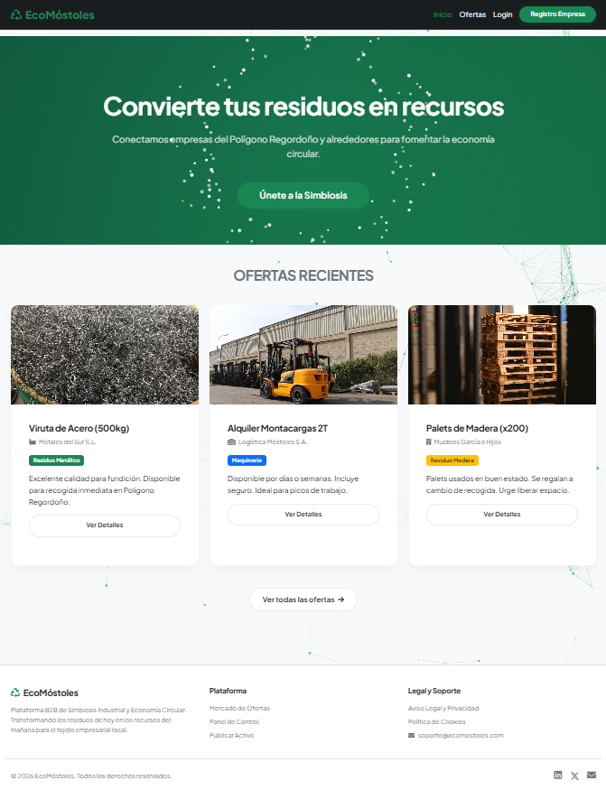

> [Página de inicio de una plataforma B2B de economía circular que conecta empresas locales para el intercambio de residuos industriales y maquinaria. Incluye una interfaz dinámica que muestra ofertas destacadas y adapta la navegación según el estado de la sesión del usuario. Integra efectos visuales avanzados con partículas interactivas para ofrecer una experiencia tecnológica y moderna centrada en la sostenibilidad. Facilita el acceso directo al registro de empresas, mercado de activos y paneles de control para la gestión de recursos.]

#### **2. Administrador de las ofertas**

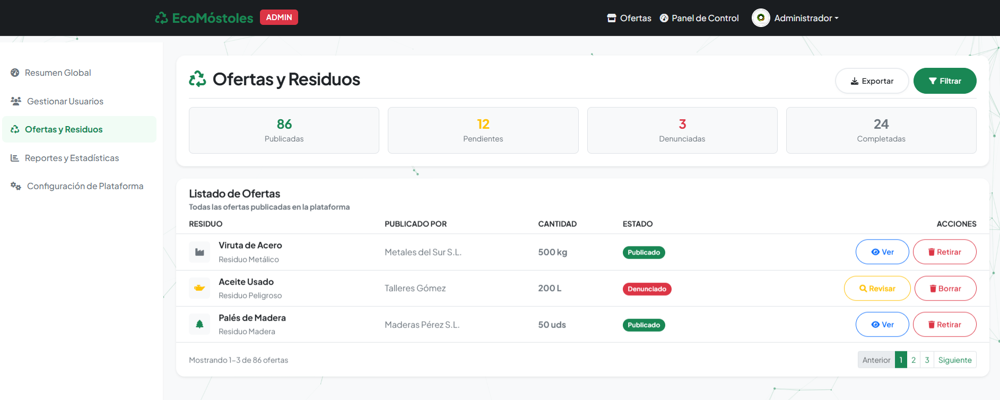

> [Panel de administración de EcoMóstoles diseñado para la gestión centralizada de ofertas y residuos industriales, permitiendo supervisar publicaciones, estados y denuncias. Incluye un dashboard con estadísticas clave, una tabla interactiva para moderar activos y una barra lateral de navegación para el control total de la plataforma. Presenta herramientas de filtrado y exportación de datos, manteniendo una estética tecnológica con fondos de partículas y un sistema de seguridad que restringe el acceso solo a usuarios autenticados.]

#### **3. Administrador de los usuarios**

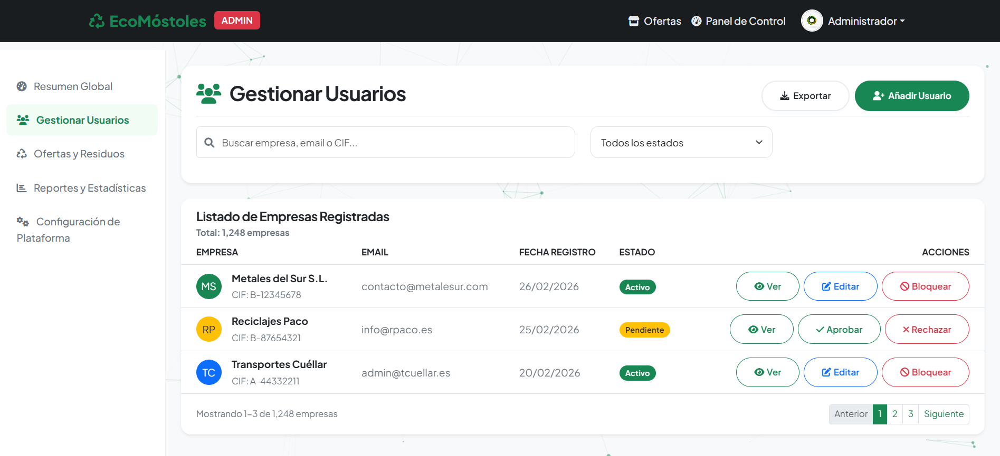

> [Esta página funciona como el centro de mando para la administración de usuarios y empresas de EcoMóstoles, permitiendo visualizar el listado completo de entidades registradas, auditar sus datos fiscales y controlar su acceso mediante herramientas para aprobar nuevas solicitudes, editar perfiles existentes o bloquear cuentas de forma inmediata. Gracias a sus filtros inteligentes y buscador integrado, facilita la gestión masiva de las más de 1.200 empresas del ecosistema, ofreciendo además opciones para exportar informes detallados o registrar nuevos usuarios manualmente para mantener el tejido industrial local siempre actualizado.]

#### **4. Configuración de la página web**

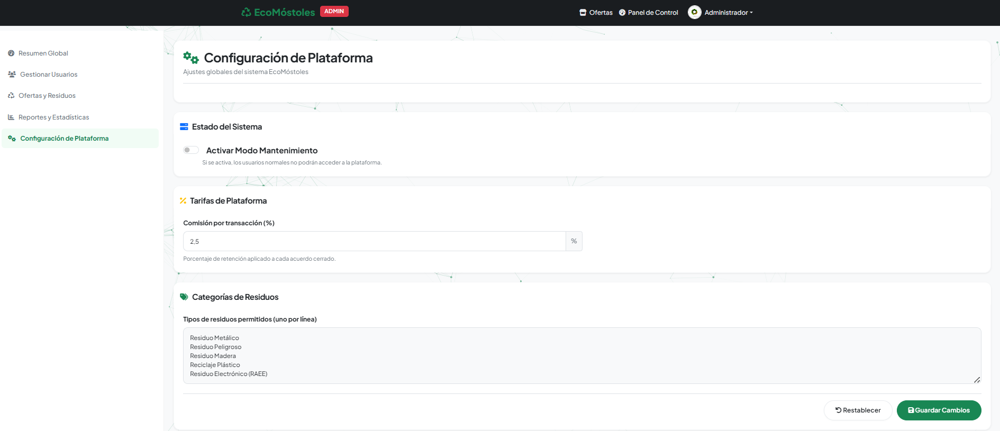

> [Esta página de Configuración de Plataforma actúa como el núcleo operativo del sistema EcoMóstoles, permitiendo a los administradores ajustar los parámetros globales que rigen el funcionamiento del portal. A través de una interfaz intuitiva, el personal autorizado puede activar el modo mantenimiento para restringir el acceso durante actualizaciones, modificar los porcentajes de comisión aplicados a las transacciones B2B y gestionar las categorías de residuos permitidas en el mercado, garantizando que la plataforma se adapte en tiempo real a las necesidades operativas y legales del tejido industrial local.]

#### **5. Dashboard**

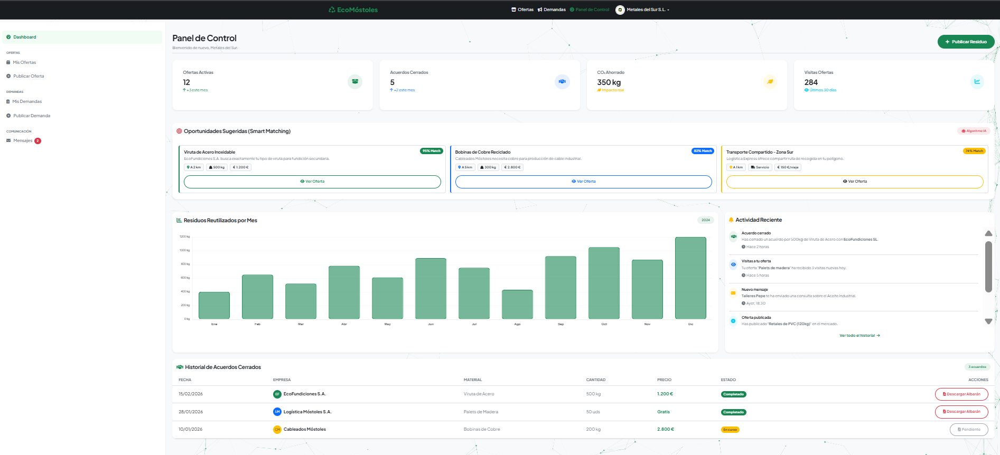

> [El dashboard de EcoMóstoles funciona como un centro neurálgico de gestión donde la empresa visualiza sus indicadores clave (KPIs), como ofertas activas, acuerdos cerrados y el CO₂ ahorrado. Permite administrar el ciclo de vida de los residuos mediante la publicación de ofertas, el seguimiento de demandas y la gestión de mensajes directos con otros colaboradores. Además, destaca por ofrecer un sistema de Smart Matching que sugiere oportunidades de negocio automáticas y un historial detallado para descargar documentos oficiales de las transacciones completadas.]

#### **6. Demandas**

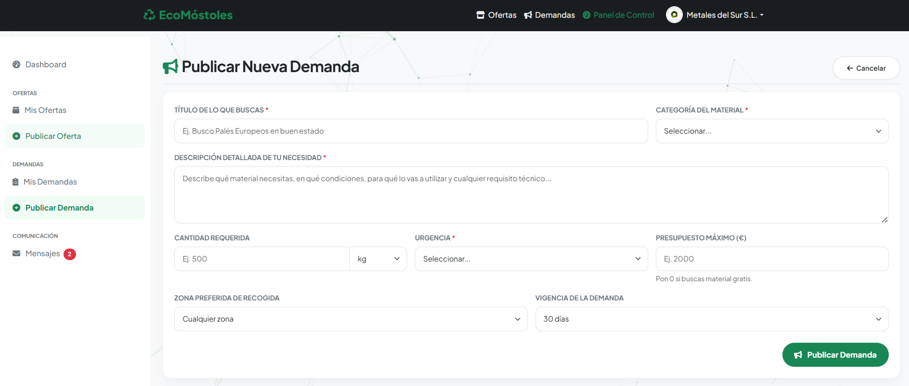

> [Esta página proporciona un formulario estructurado para que las empresas detallen sus necesidades específicas de materiales o recursos y las den a conocer a la comunidad industrial. A través de este panel, el usuario puede especificar la categoría del material, la cantidad necesaria, el presupuesto máximo y el nivel de urgencia, facilitando que otros proveedores locales identifiquen oportunidades de colaboración. Su propósito es simplificar la entrada de datos críticos —como la zona de recogida y la vigencia del anuncio— para asegurar que las solicitudes sean precisas, profesionales y eficaces dentro de la red de economía circular de la plataforma.]

#### **7. Tablón de demandas**

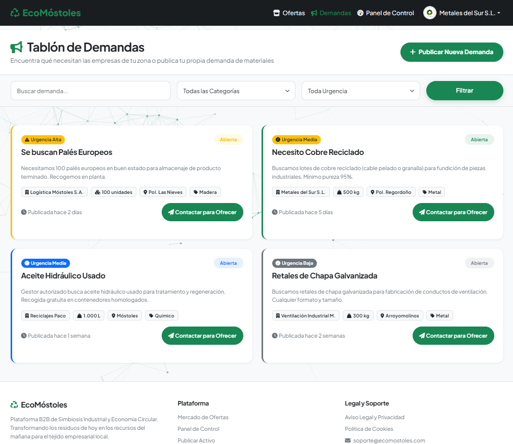

> [Esta página funciona como un mercado abierto donde las empresas pueden visualizar y filtrar las necesidades de materiales de otras organizaciones locales para ofrecer sus propios recursos sobrantes. A diferencia del panel de gestión personal, esta sección está orientada a la prospección y la interacción B2B, permitiendo a los usuarios buscar solicitudes específicas por categoría o nivel de urgencia, consultar los detalles de cada petición y contactar directamente con los demandantes para cerrar acuerdos de colaboración que fomenten la economía circular en la zona.]

#### **8. Detalles de la oferta**

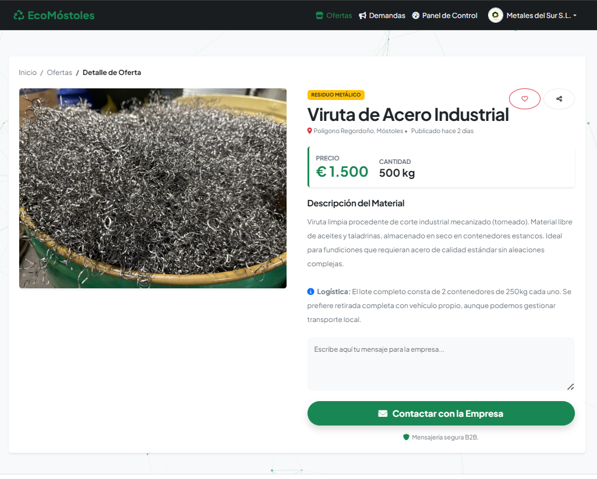

> [Esta página actúa como la ficha técnica y comercial de un recurso específico disponible en el mercado de EcoMóstoles. En este caso, presenta una oferta de "Viruta de Acero Industrial", permitiendo a los compradores potenciales evaluar rápidamente la viabilidad del material para sus procesos productivos.]

#### **9. Editar activo**

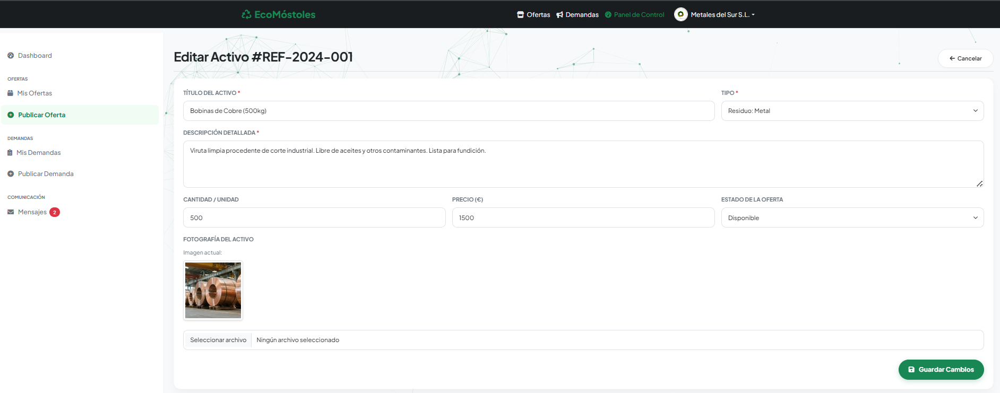

> [Esta página es el centro operativo para que las empresas gestionen la información de sus recursos publicados en el ecosistema de EcoMóstoles. En este caso, permite actualizar los detalles del activo #REF-2024-001, correspondiente a bobinas de cobre.]

#### **10. Editar demanda**

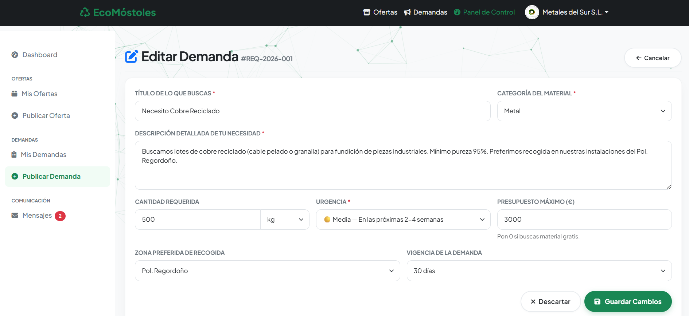

> [Esta página es la interfaz de gestión donde las empresas de EcoMóstoles ajustan sus necesidades de aprovisionamiento de materiales o servicios. A diferencia de la edición de activos (ofertas), este formulario se centra en especificaciones técnicas y urgencia logística.]

#### **11. Error 404**

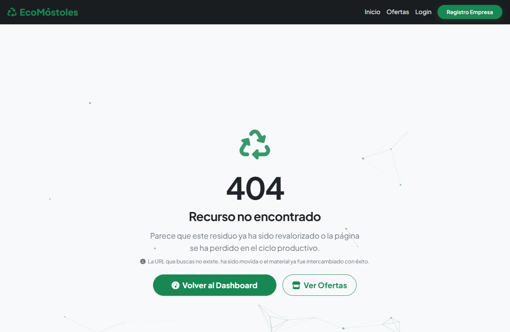

> [Esta página está diseñada específicamente para manejar situaciones donde un usuario intenta acceder a un enlace inexistente o a un recurso que ya ha sido retirado del mercado.]

#### **12. Login**

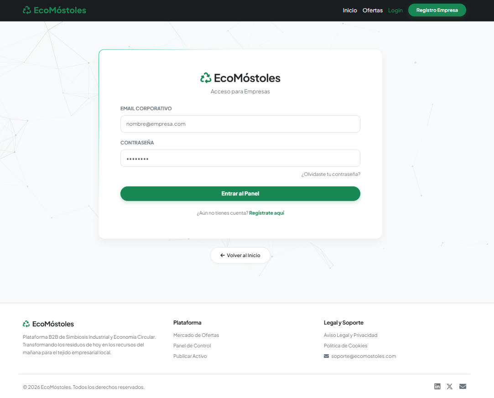

> [Esta página es la puerta de entrada para que las empresas gestionen sus activos y demandas en la plataforma. A diferencia de las páginas de contenido, aquí se prioriza una estética limpia y funcional para minimizar distracciones durante el proceso de autenticación.]

#### **13. Buzón de mensajes**

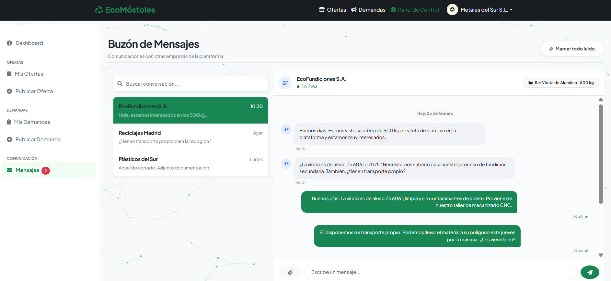

> [Esta página está diseñada como un centro de negociación directa entre empresas. A diferencia de las páginas anteriores, aquí el diseño se vuelve más complejo para soportar una comunicación fluida en tiempo real.]

#### **14. Demandas publicadas**

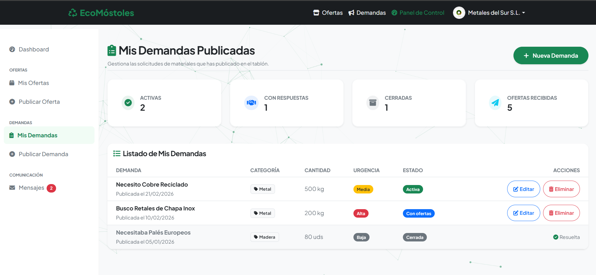

> [Esta página funciona como un panel de gestión estratégica dentro de la plataforma EcoMóstoles, diseñado específicamente para que las empresas supervisen sus necesidades de materiales y maquinaria. A través de una interfaz limpia y profesional, el usuario puede visualizar de forma inmediata el rendimiento de sus solicitudes mediante tarjetas de estadísticas (demandas activas, cerradas y ofertas recibidas) y administrar su inventario de peticiones mediante una tabla interactiva que prioriza el nivel de urgencia y el estado de cada publicación.]

#### **15. Mis ofertas**

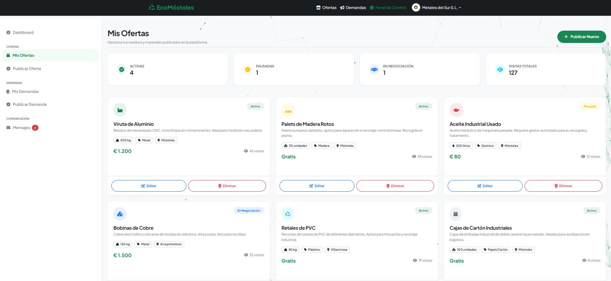

> [Esta página actúa como el centro de gestión de activos y residuos para las empresas dentro del ecosistema de EcoMóstoles. La página presenta un diseño estructurado mediante una cuadrícula de tarjetas visuales que permiten una administración ágil de los recursos publicados, tales como metales, madera o productos químicos, detallando para cada uno su estado actual (activo, pausado o en negociación), métricas de visibilidad y especificaciones técnicas como peso o ubicación.]

#### **16. Mercado**

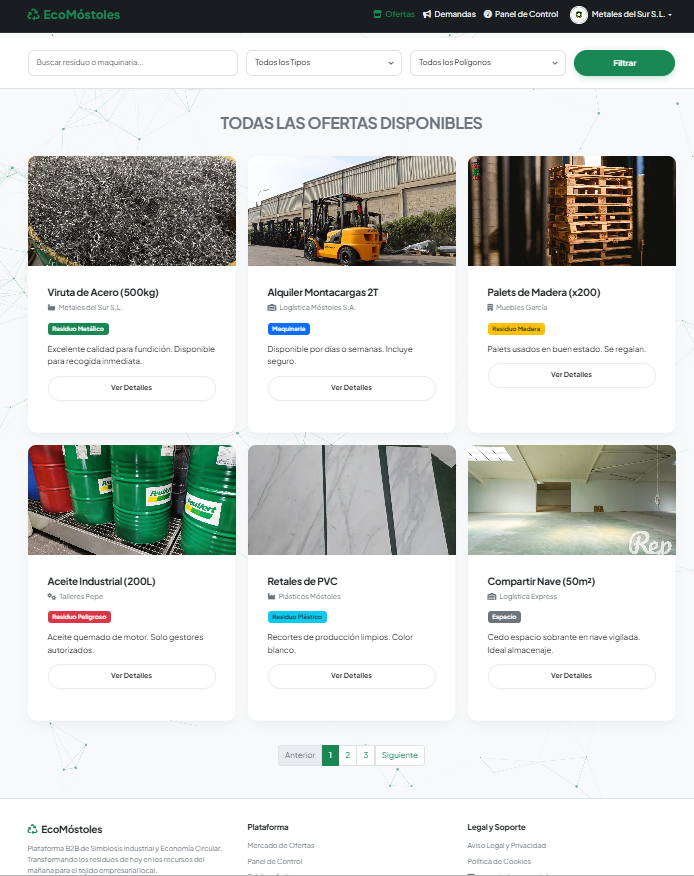

> [Esta página funciona como un catálogo interactivo de ofertas que permite a los usuarios buscar, filtrar y visualizar activos industriales disponibles, como residuos, maquinaria o espacios, mediante un sistema de búsqueda por texto, tipo de material y polígono industrial. A través de una interfaz de tarjetas detalladas, facilita la consulta de información específica de cada producto y la navegación hacia otras secciones clave como el panel de control, la publicación de nuevos activos o la gestión del perfil de la empresa.]

#### **17. Perfil de empresa**

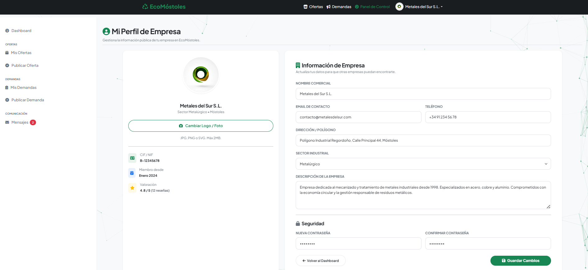

> [Esta página es donde las empresas pueden actualizar su identidad pública, incluyendo la carga del logotipo, la descripción de su actividad y datos de contacto como email, teléfono y dirección. Además de permitir la edición de información estratégica y sectorial para mejorar la visibilidad ante otros usuarios, integra opciones de seguridad para el cambio de contraseña y un menú lateral de navegación para gestionar ofertas, demandas y mensajes internos.]

#### **18. Publicar oferta**

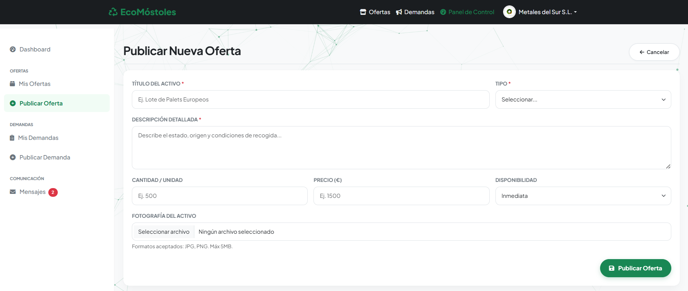

> [Esta página funciona como un formulario de creación y publicación de ofertas, diseñado para que las empresas den de alta activos industriales especificando detalles como el título, el tipo de material o servicio (residuos metálicos, madera, maquinaria, etc.), una descripción detallada, la cantidad disponible y el precio. Además, permite adjuntar una fotografía del activo y definir su disponibilidad temporal, integrando un sistema de validación de datos para asegurar que toda la información obligatoria esté completa antes de su publicación en el mercado de la plataforma.]

#### **19. Registrarse**

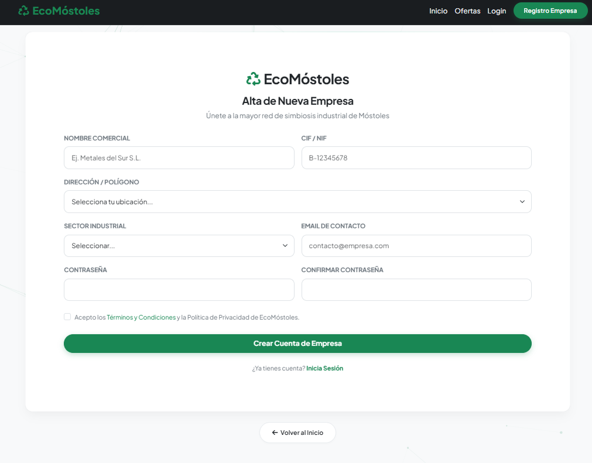

> [Esta página funciona como el portal de registro de nuevas empresas en la plataforma. Está diseñada para capturar la información jurídica y operativa esencial de las organizaciones interesadas en unirse a la red de economía circular de Móstoles.]

#### **20. Reportes para el administrador**

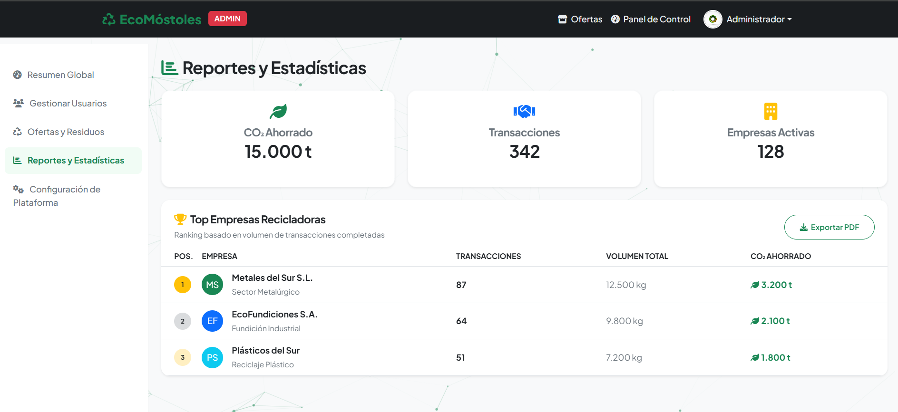

> [Esta página constituye el módulo de Reportes y Estadísticas exclusivo para el perfil de administrador. Su función principal es ofrecer una visión analítica y cuantitativa del impacto de la plataforma EcoMóstoles en el ecosistema industrial local.]

#### **21. Vista general**

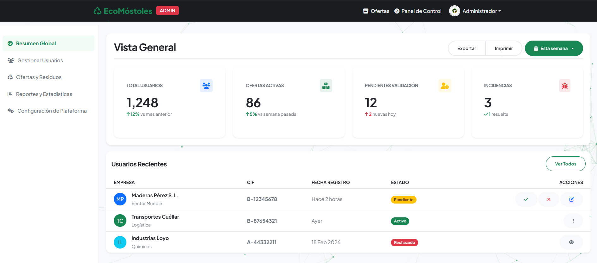

> [Esta página funciona como el centro de control administrativo de EcoMóstoles, diseñado para supervisar y gestionar el ecosistema de simbiosis industrial entre empresas locales. Su función principal es permitir la validación de nuevos usuarios, el seguimiento de métricas operativas (como el total de empresas registradas y ofertas activas) y la moderación del mercado de residuos y maquinaria. Además, ofrece herramientas para generar reportes estadísticos, gestionar incidencias técnicas y configurar los parámetros globales de la plataforma B2B. En definitiva, es la herramienta que garantiza el correcto funcionamiento operativo y la seguridad en el intercambio de recursos industriales.]

### **Participación de Miembros en la Práctica 1**

#### **Alumno 1 - [Guillermo Domínguez Galindo]**

[Guillermo Domínguez ha ejercido como Responsable de Desarrollo Frontend y Diseño UI/UX, asumiendo la creación y optimización de la arquitectura visual de la plataforma. Sus tareas principales incluyeron el diseño de paneles de gestión de activos y demandas mediante el uso de tablas, barras laterales responsivas y tarjetas de indicadores clave (KPIs), además de la implementación de la librería Particles.js para efectos dinámicos. Fue el encargado de refactorizar la navegación y la estructura de múltiples páginas (mensajería, mercado, perfil de empresa) para garantizar una experiencia de usuario fluida y coherente, integrando formularios validados con Bootstrap, gestionando la identidad visual con nuevos recursos como favicons en formato SVG y asegurando la consistencia estética en todos los niveles administrativos del proyecto.]

| Nº  |                                                                                                                                                                                                                                 Commits                                                                                                                                                                                                                                  |                                                                                   Files                                                                                    |
| :-: | :----------------------------------------------------------------------------------------------------------------------------------------------------------------------------------------------------------------------------------------------------------------------------------------------------------------------------------------------------------------------------------------------------------------------------------------------------------------------: | :------------------------------------------------------------------------------------------------------------------------------------------------------------------------: |
|  1  |                                                                                                                                    [Add styles.css with initial CSS variables, typography, and layout styles](https://github.com/CodeURJC-SSDD-2025-26/practica-ssdd-2025-26-grupo-10/tree/08a4a5b6d5e40dcef2e5bc8da80832a33176554a)                                                                                                                                     |             [styles.css](https://github.com/CodeURJC-SSDD-2025-26/practica-ssdd-2025-26-grupo-10/blob/08a4a5b6d5e40dcef2e5bc8da80832a33176554a/css/styles.css)             |
|  2  |                                                                                                                      [Add mis_activos.html with layout for asset management; include navbar, sidebar, and table for offers.](https://github.com/CodeURJC-SSDD-2025-26/practica-ssdd-2025-26-grupo-10/tree/a0169821bcbb6327777dd05ea1cf143958dcf19b)                                                                                                                      |         [mis_activos.html](https://github.com/CodeURJC-SSDD-2025-26/practica-ssdd-2025-26-grupo-10/blob/a0169821bcbb6327777dd05ea1cf143958dcf19b/mis_activos.html)         |
|  3  |                                                                                                                                         [Add particles.js library for dynamic particle effects on canvas](https://github.com/CodeURJC-SSDD-2025-26/practica-ssdd-2025-26-grupo-10/tree/f6020937f60d3f9b1b4356ddca17f882e7e28c9a)                                                                                                                                         |             [scripts.js](https://github.com/CodeURJC-SSDD-2025-26/practica-ssdd-2025-26-grupo-10/blob/f6020937f60d3f9b1b4356ddca17f882e7e28c9a/js/scripts.js)              |
|  4  |                                                                                                                                   [Add custom navbar styles and button hover effects for improved interaction](https://github.com/CodeURJC-SSDD-2025-26/practica-ssdd-2025-26-grupo-10/tree/9403f06613471f6aadb506d3ee3c317f93571c00)                                                                                                                                    |             [styles.css](https://github.com/CodeURJC-SSDD-2025-26/practica-ssdd-2025-26-grupo-10/blob/9403f06613471f6aadb506d3ee3c317f93571c00/css/styles.css)             |
|  4  |                                                                                                                             [Update styles and enhance dashboard layout with improved navbar, sidebar, and KPI cards](https://github.com/CodeURJC-SSDD-2025-26/practica-ssdd-2025-26-grupo-10/tree/d12764a2e760de0b7446cf83fbbc74071faecf94)                                                                                                                             |             [styles.css](https://github.com/CodeURJC-SSDD-2025-26/practica-ssdd-2025-26-grupo-10/blob/d12764a2e760de0b7446cf83fbbc74071faecf94/css/styles.css)             |
|  5  |                                                                                 [Refactor navigation and layout in dashboard, mensajes, mis_activos, mercado, and perfil_empresa pages; enhance user experience with consistent styling and improved structure.](https://github.com/CodeURJC-SSDD-2025-26/practica-ssdd-2025-26-grupo-10/tree/b70cf71a97196207971802fc088798a08a86c40f)                                                                                  |           [dashboard.html](https://github.com/CodeURJC-SSDD-2025-26/practica-ssdd-2025-26-grupo-10/blob/b70cf71a97196207971802fc088798a08a86c40f/dashboard.html)           |
|  6  |                                                                                    [Refactor layout in crear_activo, dashboard, mensajes, and mis_activos pages for improved structure and user experience; adjust sidebar styling for better responsiveness](https://github.com/CodeURJC-SSDD-2025-26/practica-ssdd-2025-26-grupo-10/tree/e5af96c5289843a8bad9268f8d9ee0a5bc5a0bb6)                                                                                     |        [crear_activo.html](https://github.com/CodeURJC-SSDD-2025-26/practica-ssdd-2025-26-grupo-10/blob/e5af96c5289843a8bad9268f8d9ee0a5bc5a0bb6/crear_activo.html)        |
|  7  |                                                                                                              [Add admin_reportes page and update navigation links in admin_ofertas, admin_panel, and admin_usuarios for consistency](https://github.com/CodeURJC-SSDD-2025-26/practica-ssdd-2025-26-grupo-10/tree/999699b83072e4a5ce7a6b11880d5d772113f93b)                                                                                                              | [admin_configuracion.html](https://github.com/CodeURJC-SSDD-2025-26/practica-ssdd-2025-26-grupo-10/blob/999699b83072e4a5ce7a6b11880d5d772113f93b/admin_configuracion.html) |
|  8  | [Add edit demand page and my demands page with updated layout and functionality,Created `editar_solicitud.html` for editing demand requests with form validation and Bootstrap styling,,Added `mis_demandas.html` to display user's published demands with statistics and action buttons. - Introduced a new favicon in SVG format for branding.](https://github.com/CodeURJC-SSDD-2025-26/practica-ssdd-2025-26-grupo-10/tree/bdbc6610fc9984d57baec258fb3678037906dd78) |                 [404.html](https://github.com/CodeURJC-SSDD-2025-26/practica-ssdd-2025-26-grupo-10/blob/bdbc6610fc9984d57baec258fb3678037906dd78/404.html)                 |

---

#### **Alumno 2 - [Daniel Nieto Díaz]**

[Daniel Nieto ha desempeñado el rol de Desarrollador de Frontend y Maquetador UI, centrándose en la creación y optimización de la experiencia de usuario a través de HTML5 y CSS3 con Bootstrap. Sus tareas principales incluyeron el desarrollo de los módulos de autenticación (login y registro) y la página de mercado con sistemas de filtrado por tarjetas, además de la refactorización profunda del código CSS para mejorar su legibilidad y organización. Fue el responsable de estandarizar la navegación y el pie de página (footer) en toda la aplicación, integrar recursos gráficos como iconos SVG y activos de imagen, y corregir efectos visuales avanzados (como el spotlight en componentes), garantizando una interfaz cohesiva, profesional y totalmente adaptada a las necesidades del proyecto.]

| Nº  |                                                                                                                                     Commits                                                                                                                                      |                                                                                   Files                                                                                    |
| :-: | :------------------------------------------------------------------------------------------------------------------------------------------------------------------------------------------------------------------------------------------------------------------------------: | :------------------------------------------------------------------------------------------------------------------------------------------------------------------------: |
|  1  |                      [Update README.md with detailed project description, entity definitions, user permissions, and system features](https://github.com/CodeURJC-SSDD-2025-26/practica-ssdd-2025-26-grupo-10/tree/59723ebf426ad6b05c2c5bfcf7a033e79b17bc3d)                      |                [README.md](https://github.com/CodeURJC-SSDD-2025-26/practica-ssdd-2025-26-grupo-10/blob/59723ebf426ad6b05c2c5bfcf7a033e79b17bc3d/README.md)                |
|  2  |                                             [Add initial CSS and JavaScript files; Add also basic index.html](https://github.com/CodeURJC-SSDD-2025-26/practica-ssdd-2025-26-grupo-10/tree/db5aec325c7c2f45a76f0dc2eaf72b8deac0fcfb)                                             |                      [css](https://github.com/CodeURJC-SSDD-2025-26/practica-ssdd-2025-26-grupo-10/tree/db5aec325c7c2f45a76f0dc2eaf72b8deac0fcfb/css)                      |
|  3  |                                                 [Add login and registration pages with Bootstrap styling](https://github.com/CodeURJC-SSDD-2025-26/practica-ssdd-2025-26-grupo-10/tree/34127956721047d9fc01ac97e3064ebb2bef5dbb)                                                 |               [login.html](https://github.com/CodeURJC-SSDD-2025-26/practica-ssdd-2025-26-grupo-10/blob/34127956721047d9fc01ac97e3064ebb2bef5dbb/login.html)               |
|  4  |                                    [Add mercado.html for offers display; include navigation, filters, and item cards](https://github.com/CodeURJC-SSDD-2025-26/practica-ssdd-2025-26-grupo-10/tree/887dcca26751ddb98e82a852ed5e63a97d6fc62c)                                     |             [mercado.html](https://github.com/CodeURJC-SSDD-2025-26/practica-ssdd-2025-26-grupo-10/blob/887dcca26751ddb98e82a852ed5e63a97d6fc62c/mercado.html)             |
|  5  |                                 [Refactor CSS styles for improved readability and organization; add comments for clarity](https://github.com/CodeURJC-SSDD-2025-26/practica-ssdd-2025-26-grupo-10/tree/fe9a9c6aa3edc8561c963149c042c8cd3705aa23)                                 |             [css/styles](https://github.com/CodeURJC-SSDD-2025-26/practica-ssdd-2025-26-grupo-10/blob/fe9a9c6aa3edc8561c963149c042c8cd3705aa23/css/styles.css)             |
|  6  |                                 [Enhance registration and login pages with new navbar, footer, and improved form layout](https://github.com/CodeURJC-SSDD-2025-26/practica-ssdd-2025-26-grupo-10/tree/8f624fc683f4dd9fea881de20023f11d65a59888)                                  |            [registro.html](https://github.com/CodeURJC-SSDD-2025-26/practica-ssdd-2025-26-grupo-10/blob/8f624fc683f4dd9fea881de20023f11d65a59888/registro.html)            |
|  7  |                          [Refactor CSS styles for improved organization and readability; fix spotlight effect on card component](https://github.com/CodeURJC-SSDD-2025-26/practica-ssdd-2025-26-grupo-10/tree/5774d12bf7b7c3400db03cf453b1795f8c61ada4)                          |            [css/styles.](https://github.com/CodeURJC-SSDD-2025-26/practica-ssdd-2025-26-grupo-10/blob/5774d12bf7b7c3400db03cf453b1795f8c61ada4/css/styles.css)             |
|  8  | [Enhance detalle_activo.html with Bootstrap integration, improved layout, and new footer; update navbar and content structure for better user experience](https://github.com/CodeURJC-SSDD-2025-26/practica-ssdd-2025-26-grupo-10/tree/6070acf46bd7195f684c9ebbfd7861a9c0da77fd) |      [detalle_activo.html](https://github.com/CodeURJC-SSDD-2025-26/practica-ssdd-2025-26-grupo-10/blob/6070acf46bd7195f684c9ebbfd7861a9c0da77fd/detalle_activo.html)      |
|  9  |                         [Add consistent footer across dashboard, mensajes, and detalle_activo pages for improved user experience](https://github.com/CodeURJC-SSDD-2025-26/practica-ssdd-2025-26-grupo-10/tree/e209605322a63d9baab27e5a1fe9b9fa6ac59f16)                         |      [detalle_activo.html](https://github.com/CodeURJC-SSDD-2025-26/practica-ssdd-2025-26-grupo-10/blob/e209605322a63d9baab27e5a1fe9b9fa6ac59f16/detalle_activo.html)      |
| 10  |                             [Replace Twitter icon with SVG version and update styling for consistency across multiple pages](https://github.com/CodeURJC-SSDD-2025-26/practica-ssdd-2025-26-grupo-10/tree/d3deb9068595e0a480249868c22684f84df380a2)                              |         [admin_panel.html](https://github.com/CodeURJC-SSDD-2025-26/practica-ssdd-2025-26-grupo-10/blob/d3deb9068595e0a480249868c22684f84df380a2/admin_panel.html)         |
| 11  |                               [Add new image assets and update footer layout for improved consistency and user experience](https://github.com/CodeURJC-SSDD-2025-26/practica-ssdd-2025-26-grupo-10/tree/0ce8627da156068355269497b3a282676cf26fb2)                                | [admin_configuracion.html](https://github.com/CodeURJC-SSDD-2025-26/practica-ssdd-2025-26-grupo-10/blob/0ce8627da156068355269497b3a282676cf26fb2/admin_configuracion.html) |

---

#### **Alumno 3 - [Alberto Sastre Zorrilla]**

[Alberto Sastre ha actuado como Desarrollador Frontend y Diseñador UI/UX, encargándose de la creación integral de la interfaz mediante HTML, CSS y Bootstrap. Sus responsabilidades incluyeron la maquetación de la página principal, el panel de control (dashboard) y las vistas de administración de usuarios y ofertas, además de la implementación de efectos visuales avanzados como Particles.js e interacciones dinámicas en tarjetas. Su labor abarcó desde el diseño de formularios de registro y mensajería hasta la refactorización técnica y visual de los estilos globales, garantizando una navegación coherente, responsiva y estéticamente moderna en toda la plataforma.]

| Nº  |                                                                                                                              Commits                                                                                                                               |                                                                              Files                                                                               |
| :-: | :----------------------------------------------------------------------------------------------------------------------------------------------------------------------------------------------------------------------------------------------------------------: | :--------------------------------------------------------------------------------------------------------------------------------------------------------------: |
|  1  |                                      [Add index.html with initial structure and Bootstrap integration](https://github.com/CodeURJC-SSDD-2025-26/practica-ssdd-2025-26-grupo-10/tree/eeccf5b3721c90a7dd18cf7c873bbab7d9ff473e)                                      |          [index.html](https://github.com/CodeURJC-SSDD-2025-26/practica-ssdd-2025-26-grupo-10/blob/eeccf5b3721c90a7dd18cf7c873bbab7d9ff473e/index.html)          |
|  2  |              [Add dashboard.html with initial layout and sidebar navigation; update styles.css for button and sidebar styles](https://github.com/CodeURJC-SSDD-2025-26/practica-ssdd-2025-26-grupo-10/tree/54372659b08eb3b0bc49cbc28e604569f32cab4e)               |      [dashboard.html](https://github.com/CodeURJC-SSDD-2025-26/practica-ssdd-2025-26-grupo-10/blob/54372659b08eb3b0bc49cbc28e604569f32cab4e/dashboard.html)      |
|  3  |                       [Add detalle_activo.html for offer details display; include navbar, image, and contact button](https://github.com/CodeURJC-SSDD-2025-26/practica-ssdd-2025-26-grupo-10/tree/51b7f34d0ab5313c90172c2b4a53b0ab0e877881)                        | [detalle_activo.html](https://github.com/CodeURJC-SSDD-2025-26/practica-ssdd-2025-26-grupo-10/blob/51b7f34d0ab5313c90172c2b4a53b0ab0e877881/detalle_activo.html) |
|  4  |                                   [Add spotlight effect to card component with dynamic hover interaction](https://github.com/CodeURJC-SSDD-2025-26/practica-ssdd-2025-26-grupo-10/tree/8cb8d8ab8c9012ee03359e70c1333d630370223c)                                   |        [styles.css](https://github.com/CodeURJC-SSDD-2025-26/practica-ssdd-2025-26-grupo-10/blob/8cb8d8ab8c9012ee03359e70c1333d630370223c/css/styles.css)        |
|  5  |                 [Update styles and finalize layout adjustments in CSS and HTML; enhance particle effects and clean up code](https://github.com/CodeURJC-SSDD-2025-26/practica-ssdd-2025-26-grupo-10/tree/a54d9a078ddff3dce105898dab094a0b35a33741)                 |        [styles.css](https://github.com/CodeURJC-SSDD-2025-26/practica-ssdd-2025-26-grupo-10/blob/a54d9a078ddff3dce105898dab094a0b35a33741/css/styles.css)        |
|  6  |                              [Refactor perfil_empresa.html and registro.html for improved layout and styling](https://github.com/CodeURJC-SSDD-2025-26/practica-ssdd-2025-26-grupo-10/tree/0ca01e854e85f31d5de842f573d9a39b94559068)                               | [perfil_empresa.html](https://github.com/CodeURJC-SSDD-2025-26/practica-ssdd-2025-26-grupo-10/blob/0ca01e854e85f31d5de842f573d9a39b94559068/perfil_empresa.html) |
|  7  | [ Refactor mensajes.html and crear_activo.html for improved layout and user experience; integrate particles.js for enhanced visual effects](https://github.com/CodeURJC-SSDD-2025-26/practica-ssdd-2025-26-grupo-10/tree/8b78396d720abefce95884924d19b3ccfdc8a95a) |       [mensajes.html](https://github.com/CodeURJC-SSDD-2025-26/practica-ssdd-2025-26-grupo-10/blob/8b78396d720abefce95884924d19b3ccfdc8a95a/mensajes.html)       |
|  8  |      [Add admin_ofertas and admin_usuarios pages with updated layout and styling; integrate particles.js for enhanced visual effects](https://github.com/CodeURJC-SSDD-2025-26/practica-ssdd-2025-26-grupo-10/tree/fc7d70cb8f4fa394234c1094c5cd07294f73d834)       |  [admin_ofertas.html](https://github.com/CodeURJC-SSDD-2025-26/practica-ssdd-2025-26-grupo-10/blob/fc7d70cb8f4fa394234c1094c5cd07294f73d834/admin_ofertas.html)  |
|  9  |      [Add admin_ofertas and admin_usuarios pages with updated layout and styling; integrate particles.js for enhanced visual effects](https://github.com/CodeURJC-SSDD-2025-26/practica-ssdd-2025-26-grupo-10/tree/079d13d289041a207fd06a1123f8ee7c7e9519ac)       |   [crear_activo.html](https://github.com/CodeURJC-SSDD-2025-26/practica-ssdd-2025-26-grupo-10/blob/079d13d289041a207fd06a1123f8ee7c7e9519ac/crear_activo.html)   |

---

#### **Alumno 4 - [Javier de la Casa Muñoz]**

[Javier de la Casa ha desempeñado el rol de Desarrollo Frontend y Diseño de Interfaz (UI/UX), asumiendo la responsabilidad de construir y optimizar la arquitectura visual de la plataforma mediante el uso de HTML5, CSS3 y el framework Bootstrap. Sus tareas principales incluyeron el diseño de la landing page y los flujos de autenticación, así como la creación integral de paneles de administración para la gestión, edición y visualización de activos. Además de la maquetación inicial, el alumno lideró la refactorización de componentes globales como el navbar y el footer para asegurar la coherencia estética, integrando librerías dinámicas como Particles.js para mejorar la experiencia visual y actualizando elementos de interacción (botones y logotipos) para elevar la usabilidad y el acabado profesional del proyecto.]

| Nº  |                                                                                                                                             Commits                                                                                                                                              |                                                                                   Files                                                                                    |
| :-: | :----------------------------------------------------------------------------------------------------------------------------------------------------------------------------------------------------------------------------------------------------------------------------------------------: | :------------------------------------------------------------------------------------------------------------------------------------------------------------------------: |
|  1  |                                                 [Add navbar and hero section to index.html; enhance styles in styles.css](https://github.com/CodeURJC-SSDD-2025-26/practica-ssdd-2025-26-grupo-10/tree/e328329a747073af7895f951542ca7590a783595)                                                 |               [index.html](https://github.com/CodeURJC-SSDD-2025-26/practica-ssdd-2025-26-grupo-10/blob/e328329a747073af7895f951542ca7590a783595/index.html)               |
|  2  |                                       [Add crear_activo.html for asset publication; include form for asset details and navigation](https://github.com/CodeURJC-SSDD-2025-26/practica-ssdd-2025-26-grupo-10/tree/0c9fdb9148b124226220e2a6720427d83467fe62)                                        |        [crear_activo.html](https://github.com/CodeURJC-SSDD-2025-26/practica-ssdd-2025-26-grupo-10/blob/0c9fdb9148b124226220e2a6720427d83467fe62/crear_activo.html)        |
|  3  |                                                  [Add particle effects to index.html and create particles configuration](https://github.com/CodeURJC-SSDD-2025-26/practica-ssdd-2025-26-grupo-10/tree/aca7ccaa7ac6a7396a194b82ed4b0e53a0f418cb)                                                  |               [index.html](https://github.com/CodeURJC-SSDD-2025-26/practica-ssdd-2025-26-grupo-10/blob/aca7ccaa7ac6a7396a194b82ed4b0e53a0f418cb/index.html)               |
|  4  |                               [Refactor login and registration pages for improved layout and styling; add navigation and footer components](https://github.com/CodeURJC-SSDD-2025-26/practica-ssdd-2025-26-grupo-10/tree/ce0e18569d02fa3f30e481d1d30b5aab5e4991b4)                               |            [registro.html](https://github.com/CodeURJC-SSDD-2025-26/practica-ssdd-2025-26-grupo-10/blob/ce0e18569d02fa3f30e481d1d30b5aab5e4991b4/registro.html)            |
|  5  |                                   [Add admin panel, create asset, and edit asset pages with Bootstrap integration and enhanced layouts](https://github.com/CodeURJC-SSDD-2025-26/practica-ssdd-2025-26-grupo-10/tree/281838807605d9c6930ad2eb781b15096c81dfb6)                                   |         [admin_panel.html](https://github.com/CodeURJC-SSDD-2025-26/practica-ssdd-2025-26-grupo-10/blob/281838807605d9c6930ad2eb781b15096c81dfb6/admin_panel.html)         |
|  6  |                                                    [Refactor navigation and authentication flow across multiple pages](https://github.com/CodeURJC-SSDD-2025-26/practica-ssdd-2025-26-grupo-10/tree/a4b58da06e8176b35e89328f7592f53c585bf32e)                                                    |               [index.html](https://github.com/CodeURJC-SSDD-2025-26/practica-ssdd-2025-26-grupo-10/blob/a4b58da06e8176b35e89328f7592f53c585bf32e/index.html)               |
|  7  | [Refactor detalle_activo and editar_activo pages for improved layout and user experience; update background theme and integrate particles.js for enhanced visual effects](https://github.com/CodeURJC-SSDD-2025-26/practica-ssdd-2025-26-grupo-10/tree/e2046bec900a2d971278eab18df9d91dd3820d34) |      [detalle_activo.html](https://github.com/CodeURJC-SSDD-2025-26/practica-ssdd-2025-26-grupo-10/blob/e2046bec900a2d971278eab18df9d91dd3820d34/detalle_activo.html)      |
|  8  |                    [ Update UI elements across multiple admin pages for consistency; replace initials with logo image and enhance button interactions](https://github.com/CodeURJC-SSDD-2025-26/practica-ssdd-2025-26-grupo-10/tree/b9f46816195a6b93bae30ec04f4f99cc07289599)                    | [admin_configuracion.html](https://github.com/CodeURJC-SSDD-2025-26/practica-ssdd-2025-26-grupo-10/blob/b9f46816195a6b93bae30ec04f4f99cc07289599/admin_configuracion.html) |

---

## 🛠 **Práctica 2: Web con HTML generado en servidor**

### **Navegación y Capturas de Pantalla**

#### **Diagrama de Navegación**

Solo si ha cambiado.

#### **Capturas de Pantalla Actualizadas**

Solo si han cambiado.

### **Instrucciones de Ejecución**

#### **Requisitos Previos**

- **Java**: versión 21 o superior
- **Maven**: versión 3.8 o superior
- **MySQL**: versión 8.0 o superior
- **Git**: para clonar el repositorio

#### **Pasos para ejecutar la aplicación**

1. **Clonar el repositorio**

   ```bash
   git clone https://github.com/[usuario]/[nombre-repositorio].git
   cd [nombre-repositorio]
   ```

2. **AQUÍ INDICAR LO SIGUIENTES PASOS**

#### **Credenciales de prueba**

- **Usuario Admin**: usuario: `admin`, contraseña: `admin`
- **Usuario Registrado**: usuario: `user`, contraseña: `user`

### **Diagrama de Entidades de Base de Datos**

Diagrama mostrando las entidades, sus campos y relaciones:


> [Descripción opcional: Ej: "El diagrama muestra las 4 entidades principales: Usuario, Producto, Pedido y Categoría, con sus respectivos atributos y relaciones 1:N y N:M."]

### **Diagrama de Clases y Templates**

Diagrama de clases de la aplicación con diferenciación por colores o secciones:


> [Descripción opcional del diagrama y relaciones principales]

### **Participación de Miembros en la Práctica 2**

#### **Alumno 1 - [Nombre Completo]**

[Descripción de las tareas y responsabilidades principales del alumno en el proyecto]

| Nº  |               Commits                |           Files           |
| :-: | :----------------------------------: | :-----------------------: |
|  1  | [Descripción commit 1](URL_commit_1) | [Archivo1](URL_archivo_1) |
|  2  | [Descripción commit 2](URL_commit_2) | [Archivo2](URL_archivo_2) |
|  3  | [Descripción commit 3](URL_commit_3) | [Archivo3](URL_archivo_3) |
|  4  | [Descripción commit 4](URL_commit_4) | [Archivo4](URL_archivo_4) |
|  5  | [Descripción commit 5](URL_commit_5) | [Archivo5](URL_archivo_5) |

---

#### **Alumno 2 - [Nombre Completo]**

[Descripción de las tareas y responsabilidades principales del alumno en el proyecto]

| Nº  |               Commits                |           Files           |
| :-: | :----------------------------------: | :-----------------------: |
|  1  | [Descripción commit 1](URL_commit_1) | [Archivo1](URL_archivo_1) |
|  2  | [Descripción commit 2](URL_commit_2) | [Archivo2](URL_archivo_2) |
|  3  | [Descripción commit 3](URL_commit_3) | [Archivo3](URL_archivo_3) |
|  4  | [Descripción commit 4](URL_commit_4) | [Archivo4](URL_archivo_4) |
|  5  | [Descripción commit 5](URL_commit_5) | [Archivo5](URL_archivo_5) |

---

#### **Alumno 3 - [Nombre Completo]**

[Descripción de las tareas y responsabilidades principales del alumno en el proyecto]

| Nº  |               Commits                |           Files           |
| :-: | :----------------------------------: | :-----------------------: |
|  1  | [Descripción commit 1](URL_commit_1) | [Archivo1](URL_archivo_1) |
|  2  | [Descripción commit 2](URL_commit_2) | [Archivo2](URL_archivo_2) |
|  3  | [Descripción commit 3](URL_commit_3) | [Archivo3](URL_archivo_3) |
|  4  | [Descripción commit 4](URL_commit_4) | [Archivo4](URL_archivo_4) |
|  5  | [Descripción commit 5](URL_commit_5) | [Archivo5](URL_archivo_5) |

---

#### **Alumno 4 - [Nombre Completo]**

[Descripción de las tareas y responsabilidades principales del alumno en el proyecto]

| Nº  |               Commits                |           Files           |
| :-: | :----------------------------------: | :-----------------------: |
|  1  | [Descripción commit 1](URL_commit_1) | [Archivo1](URL_archivo_1) |
|  2  | [Descripción commit 2](URL_commit_2) | [Archivo2](URL_archivo_2) |
|  3  | [Descripción commit 3](URL_commit_3) | [Archivo3](URL_archivo_3) |
|  4  | [Descripción commit 4](URL_commit_4) | [Archivo4](URL_archivo_4) |
|  5  | [Descripción commit 5](URL_commit_5) | [Archivo5](URL_archivo_5) |

---

## 🛠 **Práctica 3: API REST, docker y despliegue**

### **Documentación de la API REST**

#### **Especificación OpenAPI**

📄 **[Especificación OpenAPI (YAML)](/api-docs/api-docs.yaml)**

#### **Documentación HTML**

📖 **[Documentación API REST (HTML)](https://raw.githack.com/[usuario]/[repositorio]/main/api-docs/api-docs.html)**

> La documentación de la API REST se encuentra en la carpeta `/api-docs` del repositorio. Se ha generado automáticamente con SpringDoc a partir de las anotaciones en el código Java.

### **Diagrama de Clases y Templates Actualizado**

Diagrama actualizado incluyendo los @RestController y su relación con los @Service compartidos:


### **Instrucciones de Ejecución con Docker**

#### **Requisitos previos:**

- Docker instalado (versión 20.10 o superior)
- Docker Compose instalado (versión 2.0 o superior)

#### **Pasos para ejecutar con docker-compose:**

1. **Clonar el repositorio** (si no lo has hecho ya):

   ```bash
   git clone https://github.com/[usuario]/[repositorio].git
   cd [repositorio]
   ```

2. **AQUÍ LOS SIGUIENTES PASOS**:

### **Construcción de la Imagen Docker**

#### **Requisitos:**

- Docker instalado en el sistema

#### **Pasos para construir y publicar la imagen:**

1. **Navegar al directorio de Docker**:

   ```bash
   cd docker
   ```

2. **AQUÍ LOS SIGUIENTES PASOS**

### **Despliegue en Máquina Virtual**

#### **Requisitos:**

- Acceso a la máquina virtual (SSH)
- Clave privada para autenticación
- Conexión a la red correspondiente o VPN configurada

#### **Pasos para desplegar:**

1. **Conectar a la máquina virtual**:

   ```bash
   ssh -i [ruta/a/clave.key] [usuario]@[IP-o-dominio-VM]
   ```

   Ejemplo:

   ```bash
   ssh -i ssh-keys/app.key vmuser@10.100.139.XXX
   ```

2. **AQUÍ LOS SIGUIENTES PASOS**:

### **URL de la Aplicación Desplegada**

🌐 **URL de acceso**: `https://[nombre-app].etsii.urjc.es:8443`

#### **Credenciales de Usuarios de Ejemplo**

| Rol                | Usuario | Contraseña |
| :----------------- | :------ | :--------- |
| Administrador      | admin   | admin123   |
| Usuario Registrado | user1   | user123    |
| Usuario Registrado | user2   | user123    |

### **OTRA DOCUMENTACIÓN ADICIONAL REQUERIDA EN LA PRÁCTICA**

### **Participación de Miembros en la Práctica 3**

#### **Alumno 1 - [Nombre Completo]**

[Descripción de las tareas y responsabilidades principales del alumno en el proyecto]

| Nº  |               Commits                |           Files           |
| :-: | :----------------------------------: | :-----------------------: |
|  1  | [Descripción commit 1](URL_commit_1) | [Archivo1](URL_archivo_1) |
|  2  | [Descripción commit 2](URL_commit_2) | [Archivo2](URL_archivo_2) |
|  3  | [Descripción commit 3](URL_commit_3) | [Archivo3](URL_archivo_3) |
|  4  | [Descripción commit 4](URL_commit_4) | [Archivo4](URL_archivo_4) |
|  5  | [Descripción commit 5](URL_commit_5) | [Archivo5](URL_archivo_5) |

---

#### **Alumno 2 - [Nombre Completo]**

[Descripción de las tareas y responsabilidades principales del alumno en el proyecto]

| Nº  |               Commits                |           Files           |
| :-: | :----------------------------------: | :-----------------------: |
|  1  | [Descripción commit 1](URL_commit_1) | [Archivo1](URL_archivo_1) |
|  2  | [Descripción commit 2](URL_commit_2) | [Archivo2](URL_archivo_2) |
|  3  | [Descripción commit 3](URL_commit_3) | [Archivo3](URL_archivo_3) |
|  4  | [Descripción commit 4](URL_commit_4) | [Archivo4](URL_archivo_4) |
|  5  | [Descripción commit 5](URL_commit_5) | [Archivo5](URL_archivo_5) |

---

#### **Alumno 3 - [Nombre Completo]**

[Descripción de las tareas y responsabilidades principales del alumno en el proyecto]

| Nº  |               Commits                |           Files           |
| :-: | :----------------------------------: | :-----------------------: |
|  1  | [Descripción commit 1](URL_commit_1) | [Archivo1](URL_archivo_1) |
|  2  | [Descripción commit 2](URL_commit_2) | [Archivo2](URL_archivo_2) |
|  3  | [Descripción commit 3](URL_commit_3) | [Archivo3](URL_archivo_3) |
|  4  | [Descripción commit 4](URL_commit_4) | [Archivo4](URL_archivo_4) |
|  5  | [Descripción commit 5](URL_commit_5) | [Archivo5](URL_archivo_5) |

---

#### **Alumno 4 - [Nombre Completo]**

[Descripción de las tareas y responsabilidades principales del alumno en el proyecto]

| Nº  |               Commits                |           Files           |
| :-: | :----------------------------------: | :-----------------------: |
|  1  | [Descripción commit 1](URL_commit_1) | [Archivo1](URL_archivo_1) |
|  2  | [Descripción commit 2](URL_commit_2) | [Archivo2](URL_archivo_2) |
|  3  | [Descripción commit 3](URL_commit_3) | [Archivo3](URL_archivo_3) |
|  4  | [Descripción commit 4](URL_commit_4) | [Archivo4](URL_archivo_4) |
|  5  | [Descripción commit 5](URL_commit_5) | [Archivo5](URL_archivo_5) |

---
