# ECOMÓSTOLES B2B

## 👥 Miembros del Equipo

| Nombre y Apellidos | Correo URJC                      | Usuario GitHub  |
| :----------------- | :------------------------------- | :-------------- |
| Guillermo          | g.dominguez.2022@alumnos.urjc.es | Guilledgg06     |
| Daniel             | d.nieto.2021@alumnos.urjc.es     | nietodiazdaniel |
| Alberto            | a.sastre.2022@alumnos.urjc.es    | ASastre03       |
| Javier             | j.delacasa.2022@alumnos.urjc.es  | Javi1014        |

---

## 🎭 **Preparación: Definición del Proyecto**

### **Descripción del Tema**

El proyecto consiste en una Plataforma de Simbiosis Industrial y Economía Circular (B2B) enfocada en el ámbito local (polígonos industriales). La aplicación web permite el intercambio de recursos entre empresas: lo que para una es un residuo, para otra es materia prima. Además, facilita el alquiler de maquinaria industrial infrautilizada. El objetivo es reducir costes, optimizar recursos y ofrecer trazabilidad digital cumpliendo normativas medioambientales.

### **Entidades**

1. **Usuario (Empresa)**: Representa a los actores del sistema (PYMES industriales). Almacena credenciales, datos fiscales (CIF), ubicación y sector.
2. **Activo (Recurso)**: El objeto de intercambio. Puede ser un Residuo (oferta de material) o Maquinaria (oferta de alquiler). Contiene atributos como tipo, cantidad, estado y precio.
3. **Solicitud (Demanda)**: Representa una necesidad del mercado. Un usuario publica qué necesita si no lo encuentra en el catálogo.
4. **Acuerdo (Transacción)**: Formalización del intercambio. Vincula al Vendedor, Comprador y el Activo, almacenando el estado de la negociación y fecha.

**Relaciones entre entidades:**

- Usuario - Activo (1:N): Una empresa puede publicar múltiples activos (residuos o máquinas).
- Usuario - Solicitud (1:N): Una empresa puede crear múltiples solicitudes de materiales que necesita.
- Usuario - Acuerdo (1:N): Un acuerdo vincula a dos usuarios (comprador y vendedor).
- Activo - Acuerdo (1:1): Un activo específico se vincula a un acuerdo cuando se cierra la transacción.

### **Permisos de los Usuarios**

Los permisos se gestionan mediante un sistema RBAC (Control de Acceso Basado en Roles):

- **Usuario Anónimo (Visitante)**:
  - Permisos: Acceso en modo "lectura restringida". Puede visualizar el catálogo global (escaparate) para ver la oferta del mercado.
  - Restricción: No ve datos de contacto, precios específicos ni ubicación exacta. No puede realizar transacciones.

- **Usuario Registrado (Empresa)**:
  - Permisos: Acceso completo a la operativa. Puede publicar Activos, crear Solicitudes, ver datos de contacto y gestionar Acuerdos. Acceso a Dashboard con métricas.
  - Es dueño de: Sus propios Activos, sus Solicitudes y su Perfil de Empresa. Solo la empresa creadora puede editar o eliminar estos registros.

- **Administrador**:
  - Permisos: Supervisión y mantenimiento. Valida la legitimidad de nuevas empresas (verificación de CIF), gestiona categorías de materiales y modera contenidos ilícitos.
  - Es dueño de: Gestión global de categorías y capacidad de moderación sobre todos los Activos y Usuarios.

### **Imágenes**

La plataforma permitirá la carga de imágenes vinculadas a las siguientes entidades:

- **Activo**: Múltiples imágenes reales por activo (maquinaria o lotes de residuos) para verificar su estado.
- **Usuario (Empresa)**: Una imagen de logotipo corporativo para el perfil, mejorando la confianza B2B.

### **Gráficos**

Se integrará un Dashboard para aportar valor a la gestión empresarial con los siguientes gráficos:

- **Gráfico de impacto**: Gráfico de barras (Bar Chart) mostrando el volumen de residuos revalorizados (kg) o el ahorro económico estimado mensual.
- **Gráfico de Categorías**: Gráfico de barras o circular mostrando la distribución de activos por tipo de material o categoría.

### **Tecnología Complementaria**

Se implementará un módulo de Generación Documental y Notificaciones:

- Generación de PDFs: Al cerrar un acuerdo, el sistema genera automáticamente un Albarán de Recogida o Contrato de Alquiler con los datos de ambas partes para garantizar la trazabilidad.
- Envío de Correos: Envío automatizado del PDF generado al correo electrónico de los usuarios involucrados mediante integración con servidor SMTP.

### **Algoritmo o Consulta Avanzada**

El núcleo inteligente de la aplicación será un Sistema de "Matching" Industrial:

- **Algoritmo/Consulta**: Emparejamiento proactivo de Oferta y Demanda.
- **Descripción**: El sistema analiza periódicamente las nuevas Solicitudes (Demandas) y las compara con los Activos (Ofertas) disponibles. Es decir, calculará un "Índice de Compatibilidad" ponderando: Coincidencia de material/subcategoría, volumen requerido vs disponible (con un margen del 10%) y proximidad geográfica (priorizando mismo polígono). Como salida (output), el sistema computa y propone un listado priorizado de oportunidades de simbiosis sectorial basado en el coeficiente de afinidad calculado.

---

## 🛠 **Práctica 1: Maquetación de páginas web con HTML y CSS**

### **Diagrama de Navegación**

Diagrama que muestra cómo se navega entre las diferentes páginas de la aplicación:

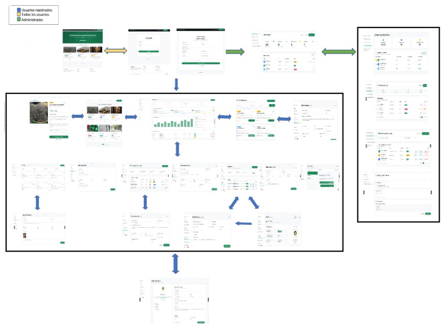

#### 1. Leyenda Visual y Arquitectura del Mapa

El diagrama de navegación adjunto muestra cómo está organizada la estructura de la plataforma B2B EcoMóstoles y cómo se gestionan los permisos de los usuarios. Para que las zonas de seguridad se entiendan claramente durante la revisión técnica, el mapa utiliza un código de colores en sus flechas. Esta guía visual divide la aplicación en tres áreas principales, marcando por dónde puede moverse el cliente según si ha iniciado sesión o el nivel de permisos que tenga su empresa.

#### 2. Flujo Público (Flechas Amarillas - Navegación Anónima)

El camino marcado por las flechas amarillas muestra la parte pública de la web, diseñada para que cualquiera pueda entrar sin restricciones (no hace falta estar identificado). Este recorrido sirve para recibir a los visitantes. Todo empieza en la página de inicio o Landing Page (index.html), desde donde se puede ir directamente a los apartados de acceso: el panel para entrar con usuario y contraseña (login.html) y el formulario para crear una cuenta nueva (registro.html). Las líneas amarillas muestran que se puede ir y volver libremente entre estas tres páginas antes de identificarse en el sistema.

#### 3. Flujo de Empresa Registrada (Flechas Azules - Core Operativo)

Una vez que el usuario se identifica, las flechas azules marcan el corazón operativo de la plataforma, un área protegida exclusiva para empresas registradas. La organización de esta zona funciona como una rueda: el Panel de Control (Dashboard) es el centro de todas las operaciones. Desde allí salen las rutas azules que permiten a la empresa gestionar por completo (crear, editar, ver y listar) los tres pilares del negocio: las Ofertas, las Demandas y los Acuerdos. Además, esta zona conecta el panel central con apartados clave como el centro de mensajes y la edición de los datos de la empresa.

#### 4. Flujo de Administración (Flechas Verdes - Supervisión Master)

El recorrido de las flechas verdes define las rutas de mayor seguridad, reservadas únicamente para los Administradores. Este camino lleva directamente a su propio panel de gestión interna (admin_panel.html), un entorno cerrado desde el cual los administradores realizan tareas de mantenimiento general: revisar informes y estadísticas, dar de alta o baja a usuarios y configurar los ajustes globales de la plataforma.

> **⚠️ Nota importante sobre los permisos:**
> En cuanto al funcionamiento interno, el rol de Administrador está diseñado con un sistema de "herencia de permisos". Esto significa que, aunque su lugar natural de trabajo sea el marcado por las flechas verdes, su acceso es total. Por lo tanto, un administrador puede entrar y moverse legalmente por cualquier parte de la plataforma, incluyendo todas las funciones de los usuarios normales (es decir, por cualquier ruta marcada con flechas azules), lo que le permite supervisar las operaciones de las empresas en tiempo real.

---

### **Capturas de Pantalla y Descripción de Páginas**

#### **1. Página Principal (index.html)**


> Página de inicio de una plataforma B2B de economía circular que conecta empresas locales para el intercambio de residuos industriales y maquinaria. Incluye una interfaz dinámica que muestra ofertas destacadas y adapta la navegación según el estado de la sesión del usuario. Integra efectos visuales avanzados con partículas interactivas para ofrecer una experiencia tecnológica y moderna centrada en la sostenibilidad. Facilita el acceso directo al registro de empresas, mercado de activos y paneles de control para la gestión de recursos.

#### **2. Moderación de Ofertas (admin_ofertas.html)**


> Panel de administración de EcoMóstoles diseñado para la gestión centralizada de ofertas y residuos industriales, permitiendo supervisar publicaciones, estados y denuncias. Incluye un dashboard con estadísticas clave, una tabla interactiva para moderar activos y una barra lateral de navegación para el control total de la plataforma. Presenta herramientas de filtrado y exportación de datos, manteniendo una estética tecnológica con fondos de partículas y un sistema de seguridad que restringe el acceso solo a usuarios autenticados.

#### \*_3. Gestión de Censos y Modificadores (admin_usuarios.html)_


> Esta página funciona como el centro de mando para la administración de usuarios y empresas de EcoMóstoles, permitiendo visualizar el listado completo de entidades registradas, auditar sus datos fiscales y controlar su acceso mediante herramientas para aprobar nuevas solicitudes, editar perfiles existentes o bloquear cuentas de forma inmediata. Gracias a sus filtros inteligentes y buscador integrado, facilita la gestión masiva de las más de 1.200 empresas del ecosistema, ofreciendo además opciones para exportar informes detallados o registrar nuevos usuarios manualmente para mantener el tejido industrial local siempre actualizado.

#### **4. Configuración del Sistema (admin_configuracion.html)**


> Esta página de Configuración de Plataforma actúa como el núcleo operativo del sistema EcoMóstoles, permitiendo a los administradores ajustar los parámetros globales que rigen el funcionamiento del portal. A través de una interfaz intuitiva, el personal autorizado puede activar el modo mantenimiento para restringir el acceso durante actualizaciones, modificar los porcentajes de comisión aplicados a las transacciones B2B y gestionar las categorías de residuos permitidas en el mercado, garantizando que la plataforma se adapte en tiempo real a las necesidades operativas y legales del tejido industrial local.

#### **5. Dashboard Operativo (dashboard.html)**


> El dashboard de EcoMóstoles funciona como un centro neurálgico de gestión donde la empresa visualiza sus indicadores clave (KPIs), como ofertas activas, acuerdos cerrados y el CO₂ ahorrado. Permite administrar el ciclo de vida de los residuos mediante la publicación de ofertas, el seguimiento de demandas y la gestión de mensajes directos con otros colaboradores. Además, destaca por ofrecer un sistema de Smart Matching que sugiere oportunidades de negocio automáticas y un historial detallado para descargar documentos oficiales de las transacciones completadas.

#### **6. Publicar Demanda (crear_solicitud.html)**


> Esta página proporciona un formulario estructurado para que las empresas detallen sus necesidades específicas de materiales o recursos y las den a conocer a la comunidad industrial. A través de este panel, el usuario puede especificar la categoría del material, la cantidad necesaria, el presupuesto máximo y el nivel de urgencia, facilitando que otros proveedores locales identifiquen oportunidades de colaboración. Su propósito es simplificar la entrada de datos críticos —como la zona de recogida y la vigencia del anuncio— para asegurar que las solicitudes sean precisas, profesionales y eficaces dentro de la red de economía circular de la plataforma.

#### **7. Tablón de Demandas (solicitudes.html)**


> Esta página funciona como un mercado abierto donde las empresas pueden visualizar y filtrar las necesidades de materiales de otras organizaciones locales para ofrecer sus propios recursos sobrantes. A diferencia del panel de gestión personal, esta sección está orientada a la prospección y la interacción B2B, permitiendo a los usuarios buscar solicitudes específicas por categoría o nivel de urgencia, consultar los detalles de cada petición y contactar directamente con los demandantes para cerrar acuerdos de colaboración que fomenten la economía circular en la zona.

#### **8. Detalle de la Oferta (detalle_activo.html)**


> Esta página actúa como la ficha técnica y comercial de un recurso específico disponible en el mercado de EcoMóstoles. En este caso, presenta una oferta de "Viruta de Acero Industrial", permitiendo a los compradores potenciales evaluar rápidamente la viabilidad del material para sus procesos productivos.

#### **9. Editar Activo (editar_activo.html)**


> Esta página es el centro operativo para que las empresas gestionen la información de sus recursos publicados en el ecosistema de EcoMóstoles. En este caso, permite actualizar los detalles del activo #REF-2024-001, correspondiente a bobinas de cobre.

#### **10. Editar Demanda (editar_solicitud.html)**


> Esta página es la interfaz de gestión donde las empresas de EcoMóstoles ajustan sus necesidades de aprovisionamiento de materiales o servicios. A diferencia de la edición de activos (ofertas), este formulario se centra en especificaciones técnicas y urgencia logística.

#### **11. Error No Encontrado (404.html)**


> Esta página está diseñada específicamente para manejar situaciones donde un usuario intenta acceder a un enlace inexistente o a un recurso que ya ha sido retirado del mercado.

#### **12. Autenticación (login.html)**


> Esta página es la puerta de entrada para que las empresas gestionen sus activos y demandas en la plataforma. A diferencia de las páginas de contenido, aquí se prioriza una estética limpia y funcional para minimizar distracciones durante el proceso de autenticación.

#### **13. Buzón de Mensajería (mensajes.html)**


> Esta página está diseñada como un centro de negociación directa entre empresas. A diferencia de las páginas anteriores, aquí el diseño se vuelve más complejo para soportar una comunicación fluida en tiempo real.

#### **14. Mis Demandas (mis_demandas.html)**


> Esta página funciona como un panel de gestión estratégica dentro de la plataforma EcoMóstoles, diseñado específicamente para que las empresas supervisen sus necesidades de materiales y maquinaria. A través de una interfaz limpia y profesional, el usuario puede visualizar de forma inmediata el rendimiento de sus solicitudes mediante tarjetas de estadísticas (demandas activas, cerradas y ofertas recibidas) y administrar su inventario de peticiones mediante una tabla interactiva que prioriza el nivel de urgencia y el estado de cada publicación.

#### **15. Mis Ofertas (mis_activos.html)**


> Esta página actúa como el centro de gestión de activos y residuos para las empresas dentro del ecosistema de EcoMóstoles. La página presenta un diseño estructurado mediante una cuadrícula de tarjetas visuales que permiten una administración ágil de los recursos publicados, tales como metales, madera o productos químicos, detallando para cada uno su estado actual (activo, pausado o en negociación), métricas de visibilidad y especificaciones técnicas como peso o ubicación.

#### **16.Mercado B2B Global (mercado.html)**


> Esta página funciona como un catálogo interactivo de ofertas que permite a los usuarios buscar, filtrar y visualizar activos industriales disponibles, como residuos, maquinaria o espacios, mediante un sistema de búsqueda por texto, tipo de material y polígono industrial. A través de una interfaz de tarjetas detalladas, facilita la consulta de información específica de cada producto y la navegación hacia otras secciones clave como el panel de control, la publicación de nuevos activos o la gestión del perfil de la empresa.

#### **17. Perfil y Configuración (perfil_empresa.html)**


> Esta página es donde las empresas pueden actualizar su identidad pública, incluyendo la carga del logotipo, la descripción de su actividad y datos de contacto como email, teléfono y dirección. Además de permitir la edición de información estratégica y sectorial para mejorar la visibilidad ante otros usuarios, integra opciones de seguridad para el cambio de contraseña y un menú lateral de navegación para gestionar ofertas, demandas y mensajes internos.

#### **18. Publicar Activo (crear_activo.html)**


> Esta página funciona como un formulario de creación y publicación de ofertas, diseñado para que las empresas den de alta activos industriales especificando detalles como el título, el tipo de material o servicio (residuos metálicos, madera, maquinaria, etc.), una descripción detallada, la cantidad disponible y el precio. Además, permite adjuntar una fotografía del activo y definir su disponibilidad temporal, integrando un sistema de validación de datos para asegurar que toda la información obligatoria esté completa antes de su publicación en el mercado de la plataforma.

#### **19. Registro de Entidad (registro.html)**


> Esta página funciona como el portal de registro de nuevas empresas en la plataforma. Está diseñada para capturar la información jurídica y operativa esencial de las organizaciones interesadas en unirse a la red de economía circular de Móstoles.

#### **20. Reportes y Estadísticas (admin_reportes.html)**


> Esta página constituye el módulo de Reportes y Estadísticas exclusivo para el perfil de administrador. Su función principal es ofrecer una visión analítica y cuantitativa del impacto de la plataforma EcoMóstoles en el ecosistema industrial local.

#### **21. Panel Master Administrativo (admin_panel.html)**


> Esta página funciona como el centro de control administrativo de EcoMóstoles, diseñado para supervisar y gestionar el ecosistema de simbiosis industrial entre empresas locales. Su función principal es permitir la validación de nuevos usuarios, el seguimiento de métricas operativas (como el total de empresas registradas y ofertas activas) y la moderación del mercado de residuos y maquinaria. Además, ofrece herramientas para generar reportes estadísticos, gestionar incidencias técnicas y configurar los parámetros globales de la plataforma B2B. En definitiva, es la herramienta que garantiza el correcto funcionamiento operativo y la seguridad en el intercambio de recursos industriales.

#### **22. Crear Acuerdo (crear_acuerdo.html)**

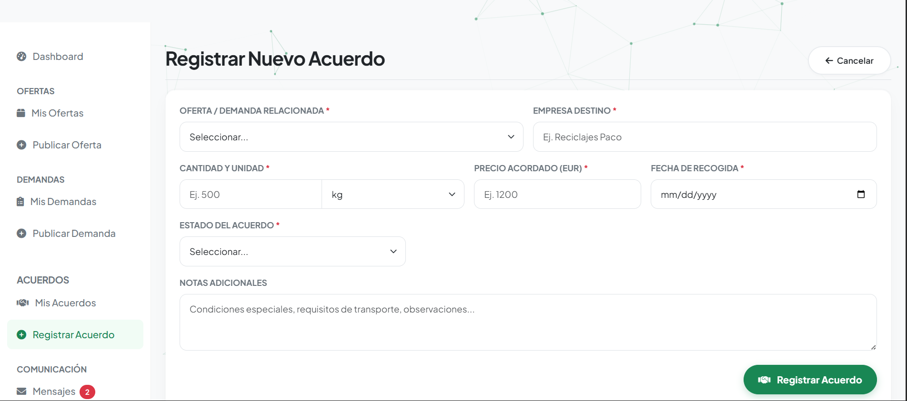

> Formulario convergente que permite formalizar un intercambio B2B. Implementa selección de entidades vinculadas y define el umbral temporal de la simbiosis industrial asegurando coherencia en la base de datos distribuida.

#### **23. Detalle del Acuerdo (detalle_acuerdo.html)**

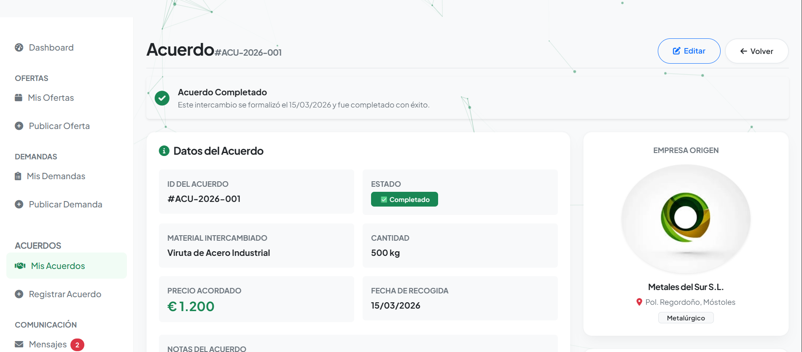

> Ficha transaccional privada que consolida jurídicamente un pacto B2B. Muestra cronogramas de estado, identidades verificadas de ambas empresas e incluye enrutamiento para la exportación o alteración del pacto.

#### **24. Detalle de la Demanda (detalle_solicitud.html)**

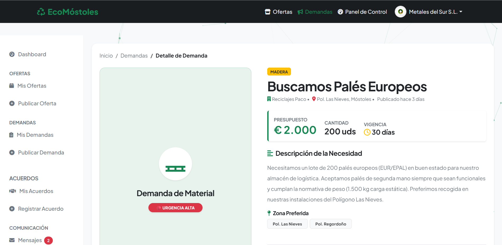

> Visor público de requerimientos emitidos por entidades corporativas. Diseñado para maximizar la legibilidad de la necesidad (fecha límite, volumen exigido y umbral económico) e incentivar la oferta cruzada mediante un botón de postulación.

#### **25. Editar Acuerdo (editar_acuerdo.html)**

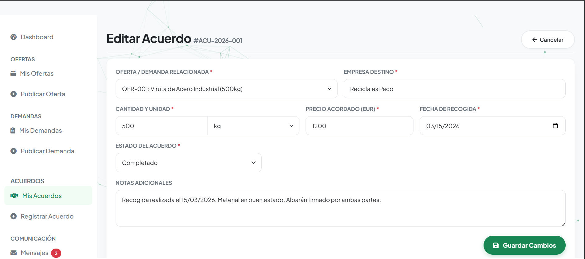

> Interfaz bidireccional donde una de las partes puede proponer alteraciones a los términos transaccionales de un pacto (ej. retraso logístico o modulación de precios) forzando re-validación de estado.

#### **26. Mis Acuerdos (mis_acuerdos.html)**

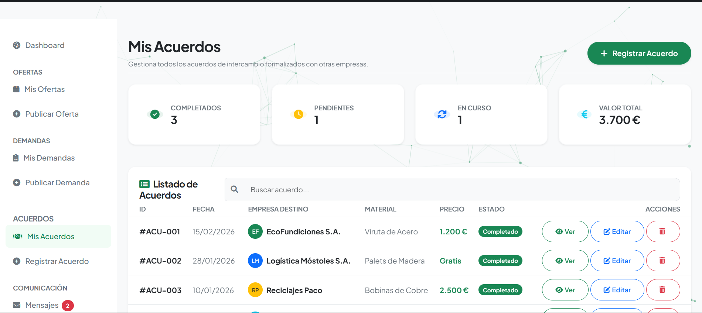

> Visor de contratos consolidados. Su interfaz tabular prioriza el seguimiento del estado de la cadena logística e integra un esquema de colores semánticos (verde: formalizado, amarillo: negociando).

### **Participación de Miembros en la Práctica 1**

#### **Alumno 1 - [Guillermo Domínguez Galindo]**

[Guillermo Domínguez ha ejercido como Responsable de Desarrollo Frontend y Diseño UI/UX, asumiendo la creación y optimización de la arquitectura visual de la plataforma. Sus tareas principales incluyeron el diseño de paneles de gestión de activos y demandas mediante el uso de tablas, barras laterales responsivas y tarjetas de indicadores clave (KPIs), además de la implementación de la librería Particles.js para efectos dinámicos. Fue el encargado de refactorizar la navegación y la estructura de múltiples páginas (mensajería, mercado, perfil de empresa) para garantizar una experiencia de usuario fluida y coherente, integrando formularios validados con Bootstrap, gestionando la identidad visual con nuevos recursos como favicons en formato SVG y asegurando la consistencia estética en todos los niveles administrativos del proyecto.]

| Nº  |                                                                                                                                                                                                                                 Commits                                                                                                                                                                                                                                  |                                                                                   Files                                                                                    |
| :-: | :----------------------------------------------------------------------------------------------------------------------------------------------------------------------------------------------------------------------------------------------------------------------------------------------------------------------------------------------------------------------------------------------------------------------------------------------------------------------: | :------------------------------------------------------------------------------------------------------------------------------------------------------------------------: |
|  1  |                                                                                                                                    [Add styles.css with initial CSS variables, typography, and layout styles](https://github.com/CodeURJC-SSDD-2025-26/practica-ssdd-2025-26-grupo-10/tree/08a4a5b6d5e40dcef2e5bc8da80832a33176554a)                                                                                                                                     |             [styles.css](https://github.com/CodeURJC-SSDD-2025-26/practica-ssdd-2025-26-grupo-10/blob/08a4a5b6d5e40dcef2e5bc8da80832a33176554a/css/styles.css)             |
|  2  |                                                                                                                      [Add mis_activos.html with layout for asset management; include navbar, sidebar, and table for offers.](https://github.com/CodeURJC-SSDD-2025-26/practica-ssdd-2025-26-grupo-10/tree/a0169821bcbb6327777dd05ea1cf143958dcf19b)                                                                                                                      |         [mis_activos.html](https://github.com/CodeURJC-SSDD-2025-26/practica-ssdd-2025-26-grupo-10/blob/a0169821bcbb6327777dd05ea1cf143958dcf19b/mis_activos.html)         |
|  3  |                                                                                                                                         [Add particles.js library for dynamic particle effects on canvas](https://github.com/CodeURJC-SSDD-2025-26/practica-ssdd-2025-26-grupo-10/tree/f6020937f60d3f9b1b4356ddca17f882e7e28c9a)                                                                                                                                         |             [scripts.js](https://github.com/CodeURJC-SSDD-2025-26/practica-ssdd-2025-26-grupo-10/blob/f6020937f60d3f9b1b4356ddca17f882e7e28c9a/js/scripts.js)              |
|  4  |                                                                                                                                   [Add custom navbar styles and button hover effects for improved interaction](https://github.com/CodeURJC-SSDD-2025-26/practica-ssdd-2025-26-grupo-10/tree/9403f06613471f6aadb506d3ee3c317f93571c00)                                                                                                                                    |             [styles.css](https://github.com/CodeURJC-SSDD-2025-26/practica-ssdd-2025-26-grupo-10/blob/9403f06613471f6aadb506d3ee3c317f93571c00/css/styles.css)             |
|  5  |                                                                                                                             [Update styles and enhance dashboard layout with improved navbar, sidebar, and KPI cards](https://github.com/CodeURJC-SSDD-2025-26/practica-ssdd-2025-26-grupo-10/tree/d12764a2e760de0b7446cf83fbbc74071faecf94)                                                                                                                             |             [styles.css](https://github.com/CodeURJC-SSDD-2025-26/practica-ssdd-2025-26-grupo-10/blob/d12764a2e760de0b7446cf83fbbc74071faecf94/css/styles.css)             |
|  6  |                                                                                 [Refactor navigation and layout in dashboard, mensajes, mis_activos, mercado, and perfil_empresa pages; enhance user experience with consistent styling and improved structure.](https://github.com/CodeURJC-SSDD-2025-26/practica-ssdd-2025-26-grupo-10/tree/b70cf71a97196207971802fc088798a08a86c40f)                                                                                  |           [dashboard.html](https://github.com/CodeURJC-SSDD-2025-26/practica-ssdd-2025-26-grupo-10/blob/b70cf71a97196207971802fc088798a08a86c40f/dashboard.html)           |
|  7  |                                                                                    [Refactor layout in crear_activo, dashboard, mensajes, and mis_activos pages for improved structure and user experience; adjust sidebar styling for better responsiveness](https://github.com/CodeURJC-SSDD-2025-26/practica-ssdd-2025-26-grupo-10/tree/e5af96c5289843a8bad9268f8d9ee0a5bc5a0bb6)                                                                                     |        [crear_activo.html](https://github.com/CodeURJC-SSDD-2025-26/practica-ssdd-2025-26-grupo-10/blob/e5af96c5289843a8bad9268f8d9ee0a5bc5a0bb6/crear_activo.html)        |
|  8  |                                                                                                              [Add admin_reportes page and update navigation links in admin_ofertas, admin_panel, and admin_usuarios for consistency](https://github.com/CodeURJC-SSDD-2025-26/practica-ssdd-2025-26-grupo-10/tree/999699b83072e4a5ce7a6b11880d5d772113f93b)                                                                                                              | [admin_configuracion.html](https://github.com/CodeURJC-SSDD-2025-26/practica-ssdd-2025-26-grupo-10/blob/999699b83072e4a5ce7a6b11880d5d772113f93b/admin_configuracion.html) |
|  9  | [Add edit demand page and my demands page with updated layout and functionality,Created `editar_solicitud.html` for editing demand requests with form validation and Bootstrap styling,,Added `mis_demandas.html` to display user's published demands with statistics and action buttons. - Introduced a new favicon in SVG format for branding.](https://github.com/CodeURJC-SSDD-2025-26/practica-ssdd-2025-26-grupo-10/tree/bdbc6610fc9984d57baec258fb3678037906dd78) |                 [404.html](https://github.com/CodeURJC-SSDD-2025-26/practica-ssdd-2025-26-grupo-10/blob/bdbc6610fc9984d57baec258fb3678037906dd78/404.html)                 |

---

#### **Alumno 2 - [Daniel Nieto Díaz]**

[Daniel Nieto ha desempeñado el rol de Desarrollador de Frontend y Maquetador UI, centrándose en la creación y optimización de la experiencia de usuario a través de HTML5 y CSS3 con Bootstrap. Sus tareas principales incluyeron el desarrollo de los módulos de autenticación (login y registro) y la página de mercado con sistemas de filtrado por tarjetas, además de la refactorización profunda del código CSS para mejorar su legibilidad y organización. Fue el responsable de estandarizar la navegación y el pie de página (footer) en toda la aplicación, integrar recursos gráficos como iconos SVG y activos de imagen, y corregir efectos visuales avanzados (como el spotlight en componentes), garantizando una interfaz cohesiva, profesional y totalmente adaptada a las necesidades del proyecto.]

| Nº  |                                                                                                                                     Commits                                                                                                                                      |                                                                                   Files                                                                                    |
| :-: | :------------------------------------------------------------------------------------------------------------------------------------------------------------------------------------------------------------------------------------------------------------------------------: | :------------------------------------------------------------------------------------------------------------------------------------------------------------------------: |
|  1  |                      [Update README.md with detailed project description, entity definitions, user permissions, and system features](https://github.com/CodeURJC-SSDD-2025-26/practica-ssdd-2025-26-grupo-10/tree/59723ebf426ad6b05c2c5bfcf7a033e79b17bc3d)                      |                [README.md](https://github.com/CodeURJC-SSDD-2025-26/practica-ssdd-2025-26-grupo-10/blob/59723ebf426ad6b05c2c5bfcf7a033e79b17bc3d/README.md)                |
|  2  |                                             [Add initial CSS and JavaScript files; Add also basic index.html](https://github.com/CodeURJC-SSDD-2025-26/practica-ssdd-2025-26-grupo-10/tree/db5aec325c7c2f45a76f0dc2eaf72b8deac0fcfb)                                             |                      [css](https://github.com/CodeURJC-SSDD-2025-26/practica-ssdd-2025-26-grupo-10/tree/db5aec325c7c2f45a76f0dc2eaf72b8deac0fcfb/css)                      |
|  3  |                                                 [Add login and registration pages with Bootstrap styling](https://github.com/CodeURJC-SSDD-2025-26/practica-ssdd-2025-26-grupo-10/tree/34127956721047d9fc01ac97e3064ebb2bef5dbb)                                                 |               [login.html](https://github.com/CodeURJC-SSDD-2025-26/practica-ssdd-2025-26-grupo-10/blob/34127956721047d9fc01ac97e3064ebb2bef5dbb/login.html)               |
|  4  |                                    [Add mercado.html for offers display; include navigation, filters, and item cards](https://github.com/CodeURJC-SSDD-2025-26/practica-ssdd-2025-26-grupo-10/tree/887dcca26751ddb98e82a852ed5e63a97d6fc62c)                                     |             [mercado.html](https://github.com/CodeURJC-SSDD-2025-26/practica-ssdd-2025-26-grupo-10/blob/887dcca26751ddb98e82a852ed5e63a97d6fc62c/mercado.html)             |
|  5  |                                 [Refactor CSS styles for improved readability and organization; add comments for clarity](https://github.com/CodeURJC-SSDD-2025-26/practica-ssdd-2025-26-grupo-10/tree/fe9a9c6aa3edc8561c963149c042c8cd3705aa23)                                 |           [css/styles.css](https://github.com/CodeURJC-SSDD-2025-26/practica-ssdd-2025-26-grupo-10/blob/fe9a9c6aa3edc8561c963149c042c8cd3705aa23/css/styles.css)           |
|  6  |                                 [Enhance registration and login pages with new navbar, footer, and improved form layout](https://github.com/CodeURJC-SSDD-2025-26/practica-ssdd-2025-26-grupo-10/tree/8f624fc683f4dd9fea881de20023f11d65a59888)                                  |            [registro.html](https://github.com/CodeURJC-SSDD-2025-26/practica-ssdd-2025-26-grupo-10/blob/8f624fc683f4dd9fea881de20023f11d65a59888/registro.html)            |
|  7  |                          [Refactor CSS styles for improved organization and readability; fix spotlight effect on card component](https://github.com/CodeURJC-SSDD-2025-26/practica-ssdd-2025-26-grupo-10/tree/5774d12bf7b7c3400db03cf453b1795f8c61ada4)                          |            [css/styles.](https://github.com/CodeURJC-SSDD-2025-26/practica-ssdd-2025-26-grupo-10/blob/5774d12bf7b7c3400db03cf453b1795f8c61ada4/css/styles.css)             |
|  8  | [Enhance detalle_activo.html with Bootstrap integration, improved layout, and new footer; update navbar and content structure for better user experience](https://github.com/CodeURJC-SSDD-2025-26/practica-ssdd-2025-26-grupo-10/tree/6070acf46bd7195f684c9ebbfd7861a9c0da77fd) |      [detalle_activo.html](https://github.com/CodeURJC-SSDD-2025-26/practica-ssdd-2025-26-grupo-10/blob/6070acf46bd7195f684c9ebbfd7861a9c0da77fd/detalle_activo.html)      |
|  9  |                         [Add consistent footer across dashboard, mensajes, and detalle_activo pages for improved user experience](https://github.com/CodeURJC-SSDD-2025-26/practica-ssdd-2025-26-grupo-10/tree/e209605322a63d9baab27e5a1fe9b9fa6ac59f16)                         |      [detalle_activo.html](https://github.com/CodeURJC-SSDD-2025-26/practica-ssdd-2025-26-grupo-10/blob/e209605322a63d9baab27e5a1fe9b9fa6ac59f16/detalle_activo.html)      |
| 10  |                             [Replace Twitter icon with SVG version and update styling for consistency across multiple pages](https://github.com/CodeURJC-SSDD-2025-26/practica-ssdd-2025-26-grupo-10/tree/d3deb9068595e0a480249868c22684f84df380a2)                              |         [admin_panel.html](https://github.com/CodeURJC-SSDD-2025-26/practica-ssdd-2025-26-grupo-10/blob/d3deb9068595e0a480249868c22684f84df380a2/admin_panel.html)         |
| 11  |                               [Add new image assets and update footer layout for improved consistency and user experience](https://github.com/CodeURJC-SSDD-2025-26/practica-ssdd-2025-26-grupo-10/tree/0ce8627da156068355269497b3a282676cf26fb2)                                | [admin_configuracion.html](https://github.com/CodeURJC-SSDD-2025-26/practica-ssdd-2025-26-grupo-10/blob/0ce8627da156068355269497b3a282676cf26fb2/admin_configuracion.html) |
| 12  |                        [Add authentication and form handling scripts; implement particle effects for login and registration pages](https://github.com/CodeURJC-SSDD-2025-26/practica-ssdd-2025-26-grupo-10/tree/95564bd80a017502fabf9a5ab436a9af6de199b8)                        |       [crear_acuerdo.html](https://github.com/CodeURJC-SSDD-2025-26/practica-ssdd-2025-26-grupo-10/blob/95564bd80a017502fabf9a5ab436a9af6de199b8/crear_acuerdo.html)       |

---

#### **Alumno 3 - [Alberto Sastre Zorrilla]**

[Alberto Sastre ha actuado como Desarrollador Frontend y Diseñador UI/UX, encargándose de la creación integral de la interfaz mediante HTML, CSS y Bootstrap. Sus responsabilidades incluyeron la maquetación de la página principal, el panel de control (dashboard) y las vistas de administración de usuarios y ofertas, además de la implementación de efectos visuales avanzados como Particles.js e interacciones dinámicas en tarjetas. Su labor abarcó desde el diseño de formularios de registro y mensajería hasta la refactorización técnica y visual de los estilos globales, garantizando una navegación coherente, responsiva y estéticamente moderna en toda la plataforma.]

| Nº  |                                                                                                                              Commits                                                                                                                               |                                                                              Files                                                                               |
| :-: | :----------------------------------------------------------------------------------------------------------------------------------------------------------------------------------------------------------------------------------------------------------------: | :--------------------------------------------------------------------------------------------------------------------------------------------------------------: |
|  1  |                                      [Add index.html with initial structure and Bootstrap integration](https://github.com/CodeURJC-SSDD-2025-26/practica-ssdd-2025-26-grupo-10/tree/eeccf5b3721c90a7dd18cf7c873bbab7d9ff473e)                                      |          [index.html](https://github.com/CodeURJC-SSDD-2025-26/practica-ssdd-2025-26-grupo-10/blob/eeccf5b3721c90a7dd18cf7c873bbab7d9ff473e/index.html)          |
|  2  |              [Add dashboard.html with initial layout and sidebar navigation; update styles.css for button and sidebar styles](https://github.com/CodeURJC-SSDD-2025-26/practica-ssdd-2025-26-grupo-10/tree/54372659b08eb3b0bc49cbc28e604569f32cab4e)               |      [dashboard.html](https://github.com/CodeURJC-SSDD-2025-26/practica-ssdd-2025-26-grupo-10/blob/54372659b08eb3b0bc49cbc28e604569f32cab4e/dashboard.html)      |
|  3  |                       [Add detalle_activo.html for offer details display; include navbar, image, and contact button](https://github.com/CodeURJC-SSDD-2025-26/practica-ssdd-2025-26-grupo-10/tree/51b7f34d0ab5313c90172c2b4a53b0ab0e877881)                        | [detalle_activo.html](https://github.com/CodeURJC-SSDD-2025-26/practica-ssdd-2025-26-grupo-10/blob/51b7f34d0ab5313c90172c2b4a53b0ab0e877881/detalle_activo.html) |
|  4  |                                   [Add spotlight effect to card component with dynamic hover interaction](https://github.com/CodeURJC-SSDD-2025-26/practica-ssdd-2025-26-grupo-10/tree/8cb8d8ab8c9012ee03359e70c1333d630370223c)                                   |        [styles.css](https://github.com/CodeURJC-SSDD-2025-26/practica-ssdd-2025-26-grupo-10/blob/8cb8d8ab8c9012ee03359e70c1333d630370223c/css/styles.css)        |
|  5  |                 [Update styles and finalize layout adjustments in CSS and HTML; enhance particle effects and clean up code](https://github.com/CodeURJC-SSDD-2025-26/practica-ssdd-2025-26-grupo-10/tree/a54d9a078ddff3dce105898dab094a0b35a33741)                 |        [styles.css](https://github.com/CodeURJC-SSDD-2025-26/practica-ssdd-2025-26-grupo-10/blob/a54d9a078ddff3dce105898dab094a0b35a33741/css/styles.css)        |
|  6  |                              [Refactor perfil_empresa.html and registro.html for improved layout and styling](https://github.com/CodeURJC-SSDD-2025-26/practica-ssdd-2025-26-grupo-10/tree/0ca01e854e85f31d5de842f573d9a39b94559068)                               | [perfil_empresa.html](https://github.com/CodeURJC-SSDD-2025-26/practica-ssdd-2025-26-grupo-10/blob/0ca01e854e85f31d5de842f573d9a39b94559068/perfil_empresa.html) |
|  7  | [ Refactor mensajes.html and crear_activo.html for improved layout and user experience; integrate particles.js for enhanced visual effects](https://github.com/CodeURJC-SSDD-2025-26/practica-ssdd-2025-26-grupo-10/tree/8b78396d720abefce95884924d19b3ccfdc8a95a) |       [mensajes.html](https://github.com/CodeURJC-SSDD-2025-26/practica-ssdd-2025-26-grupo-10/blob/8b78396d720abefce95884924d19b3ccfdc8a95a/mensajes.html)       |
|  8  |      [Add admin_ofertas and admin_usuarios pages with updated layout and styling; integrate particles.js for enhanced visual effects](https://github.com/CodeURJC-SSDD-2025-26/practica-ssdd-2025-26-grupo-10/tree/fc7d70cb8f4fa394234c1094c5cd07294f73d834)       |  [admin_ofertas.html](https://github.com/CodeURJC-SSDD-2025-26/practica-ssdd-2025-26-grupo-10/blob/fc7d70cb8f4fa394234c1094c5cd07294f73d834/admin_ofertas.html)  |
|  9  |      [Add admin_ofertas and admin_usuarios pages with updated layout and styling; integrate particles.js for enhanced visual effects](https://github.com/CodeURJC-SSDD-2025-26/practica-ssdd-2025-26-grupo-10/tree/079d13d289041a207fd06a1123f8ee7c7e9519ac)       |   [crear_activo.html](https://github.com/CodeURJC-SSDD-2025-26/practica-ssdd-2025-26-grupo-10/blob/079d13d289041a207fd06a1123f8ee7c7e9519ac/crear_activo.html)   |

---

#### **Alumno 4 - [Javier de la Casa Muñoz]**

[Javier de la Casa ha desempeñado el rol de Desarrollo Frontend y Diseño de Interfaz (UI/UX), asumiendo la responsabilidad de construir y optimizar la arquitectura visual de la plataforma mediante el uso de HTML5, CSS3 y el framework Bootstrap. Sus tareas principales incluyeron el diseño de la landing page y los flujos de autenticación, así como la creación integral de paneles de administración para la gestión, edición y visualización de activos. Además de la maquetación inicial, el alumno lideró la refactorización de componentes globales como el navbar y el footer para asegurar la coherencia estética, integrando librerías dinámicas como Particles.js para mejorar la experiencia visual y actualizando elementos de interacción (botones y logotipos) para elevar la usabilidad y el acabado profesional del proyecto.]

| Nº  |                                                                                                                                             Commits                                                                                                                                              |                                                                                   Files                                                                                    |
| :-: | :----------------------------------------------------------------------------------------------------------------------------------------------------------------------------------------------------------------------------------------------------------------------------------------------: | :------------------------------------------------------------------------------------------------------------------------------------------------------------------------: |
|  1  |                                                 [Add navbar and hero section to index.html; enhance styles in styles.css](https://github.com/CodeURJC-SSDD-2025-26/practica-ssdd-2025-26-grupo-10/tree/e328329a747073af7895f951542ca7590a783595)                                                 |               [index.html](https://github.com/CodeURJC-SSDD-2025-26/practica-ssdd-2025-26-grupo-10/blob/e328329a747073af7895f951542ca7590a783595/index.html)               |
|  2  |                                       [Add crear_activo.html for asset publication; include form for asset details and navigation](https://github.com/CodeURJC-SSDD-2025-26/practica-ssdd-2025-26-grupo-10/tree/0c9fdb9148b124226220e2a6720427d83467fe62)                                        |        [crear_activo.html](https://github.com/CodeURJC-SSDD-2025-26/practica-ssdd-2025-26-grupo-10/blob/0c9fdb9148b124226220e2a6720427d83467fe62/crear_activo.html)        |
|  3  |                                                  [Add particle effects to index.html and create particles configuration](https://github.com/CodeURJC-SSDD-2025-26/practica-ssdd-2025-26-grupo-10/tree/aca7ccaa7ac6a7396a194b82ed4b0e53a0f418cb)                                                  |               [index.html](https://github.com/CodeURJC-SSDD-2025-26/practica-ssdd-2025-26-grupo-10/blob/aca7ccaa7ac6a7396a194b82ed4b0e53a0f418cb/index.html)               |
|  4  |                               [Refactor login and registration pages for improved layout and styling; add navigation and footer components](https://github.com/CodeURJC-SSDD-2025-26/practica-ssdd-2025-26-grupo-10/tree/ce0e18569d02fa3f30e481d1d30b5aab5e4991b4)                               |            [registro.html](https://github.com/CodeURJC-SSDD-2025-26/practica-ssdd-2025-26-grupo-10/blob/ce0e18569d02fa3f30e481d1d30b5aab5e4991b4/registro.html)            |
|  5  |                                   [Add admin panel, create asset, and edit asset pages with Bootstrap integration and enhanced layouts](https://github.com/CodeURJC-SSDD-2025-26/practica-ssdd-2025-26-grupo-10/tree/281838807605d9c6930ad2eb781b15096c81dfb6)                                   |         [admin_panel.html](https://github.com/CodeURJC-SSDD-2025-26/practica-ssdd-2025-26-grupo-10/blob/281838807605d9c6930ad2eb781b15096c81dfb6/admin_panel.html)         |
|  6  |                                                    [Refactor navigation and authentication flow across multiple pages](https://github.com/CodeURJC-SSDD-2025-26/practica-ssdd-2025-26-grupo-10/tree/a4b58da06e8176b35e89328f7592f53c585bf32e)                                                    |               [index.html](https://github.com/CodeURJC-SSDD-2025-26/practica-ssdd-2025-26-grupo-10/blob/a4b58da06e8176b35e89328f7592f53c585bf32e/index.html)               |
|  7  | [Refactor detalle_activo and editar_activo pages for improved layout and user experience; update background theme and integrate particles.js for enhanced visual effects](https://github.com/CodeURJC-SSDD-2025-26/practica-ssdd-2025-26-grupo-10/tree/e2046bec900a2d971278eab18df9d91dd3820d34) |      [detalle_activo.html](https://github.com/CodeURJC-SSDD-2025-26/practica-ssdd-2025-26-grupo-10/blob/e2046bec900a2d971278eab18df9d91dd3820d34/detalle_activo.html)      |
|  8  |                    [ Update UI elements across multiple admin pages for consistency; replace initials with logo image and enhance button interactions](https://github.com/CodeURJC-SSDD-2025-26/practica-ssdd-2025-26-grupo-10/tree/b9f46816195a6b93bae30ec04f4f99cc07289599)                    | [admin_configuracion.html](https://github.com/CodeURJC-SSDD-2025-26/practica-ssdd-2025-26-grupo-10/blob/b9f46816195a6b93bae30ec04f4f99cc07289599/admin_configuracion.html) |

---

## 🛠 **Práctica 2: Web con HTML generado en servidor**

### **Navegación y Capturas de Pantalla**

#### **Diagrama de Navegación**


#### **Capturas de Pantalla Actualizadas**

#### **1. Página Principal (index.html)**

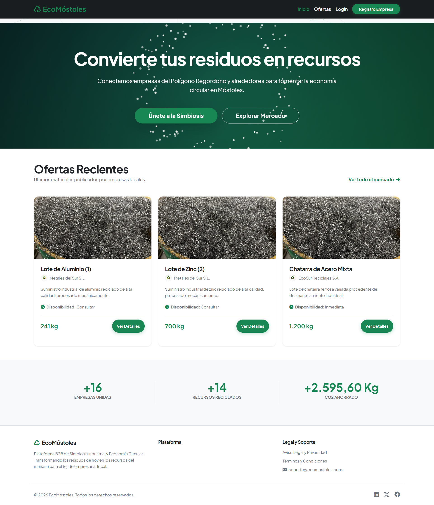

> Esta es la página de inicio pública de EcoMóstoles, diseñada para ser la primera toma de contacto de las empresas con la plataforma. Cuenta con una cabecera visual y muestra directamente las ofertas más recientes del mercado, junto con un panel de estadísticas reales sobre el impacto ambiental (como el ahorro acumulado de CO2). A nivel de desarrollo, emplea plantillas Mustache para reutilizar componentes comunes —como la cabecera y el pie de página— y utiliza el framework Bootstrap 5 para garantizar que el diseño sea totalmente responsive y adaptable a dispositivos móviles.

#### **2. Acceso de Usuarios (login.html)**

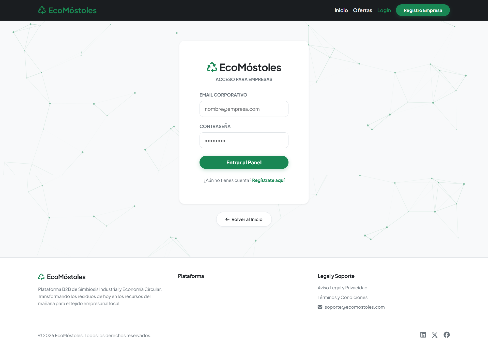

> Pantalla de autenticación para las empresas registradas. Se ha optado por un diseño limpio y centrado que facilita el acceso sin distracciones. El formulario está integrado directamente con Spring Security y cuenta con protección nativa contra ataques CSRF, garantizando un inicio de sesión seguro. Además, incluye un sistema de notificaciones dinámicas que informa al usuario mediante alertas visuales si hay algún error en las credenciales o si viene de completar su registro con éxito.

#### **3. Registro de Instituciones (registro.html)**

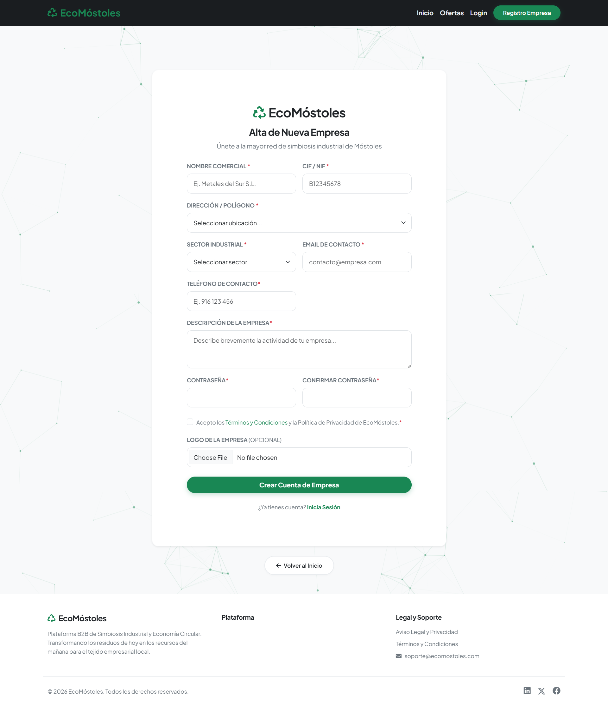

> Formulario de alta para las nuevas empresas que deseen unirse a la plataforma. Solicita la información corporativa básica e incluye funcionalidades dinámicas mediante JavaScript, como el despliegue de campos de texto adicionales al seleccionar ciertas opciones de ubicación. También incorpora validación en el navegador para evitar la subida de logotipos excesivamente pesados. Si el servidor detecta algún error en los datos, la vista recarga el formulario manteniendo la información ya introducida y marcando visualmente qué campos deben corregirse.

#### **4. Marco Legal y Normativo (terminos.html)**

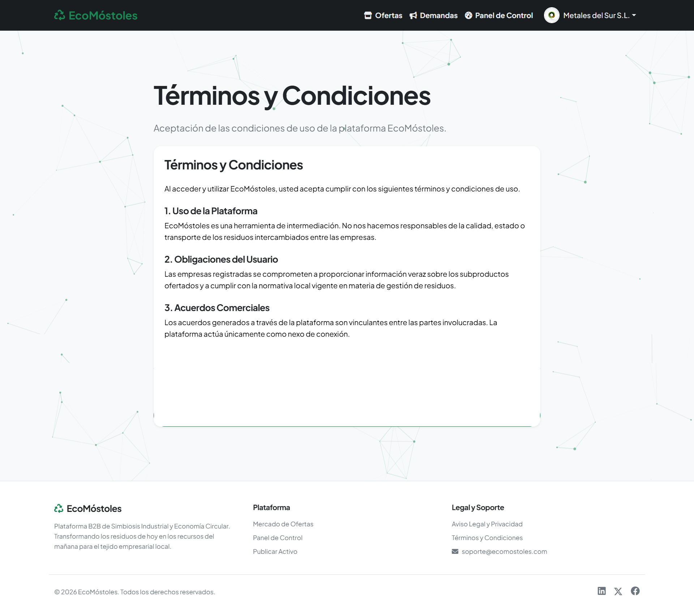

> Sección informativa dedicada a los Términos y Condiciones de uso. Este documento establece las normas operativas de la red, aclarando el papel de EcoMóstoles como plataforma intermediaria y definiendo las responsabilidades de las empresas respecto a la gestión de sus propios residuos. Dado el carácter formal del texto, el diseño se ha estructurado utilizando márgenes amplios y una jerarquía clara para facilitar su lectura y comprensión por parte de los usuarios.

#### **5. Protección de Datos (privacidad.html)**

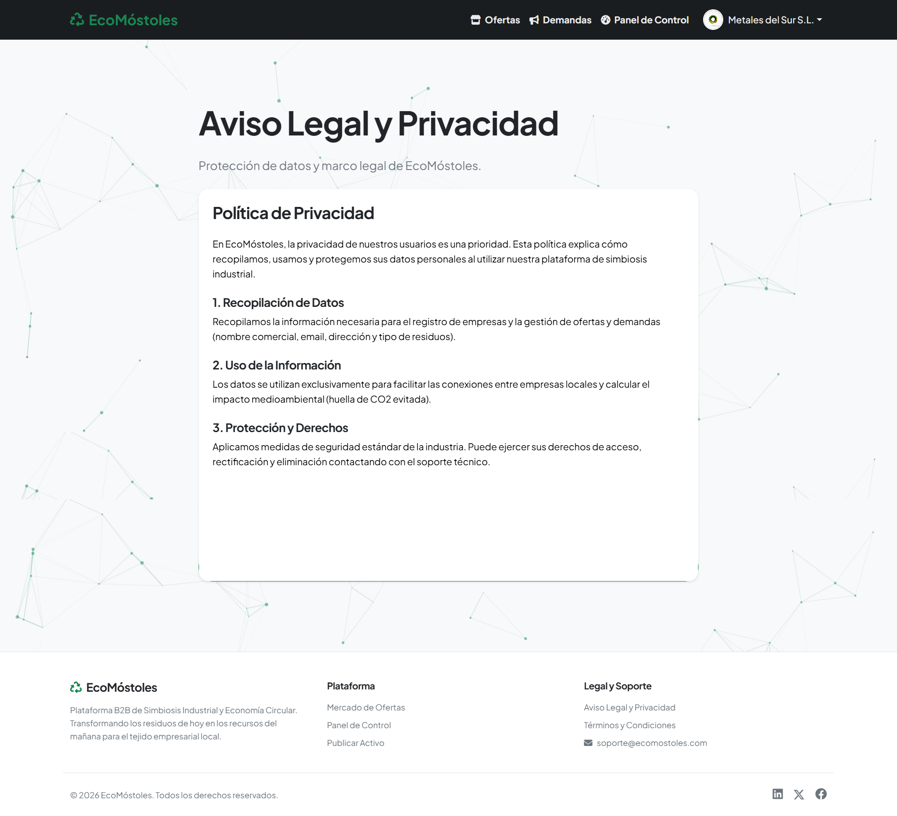

> Esta vista recoge la política de privacidad y el aviso legal de la plataforma. Explica de forma transparente cómo se recopila y gestiona la información de las empresas, especialmente los datos utilizados para calcular las métricas de impacto ambiental. Al igual que la página de términos y condiciones, presenta el contenido legal con una estructura clara y un diseño ordenado, asegurando que los usuarios conozcan sus derechos sobre la información que comparten en el sistema.

#### **6. Panel de Control de Empresas (dashboard.html)**

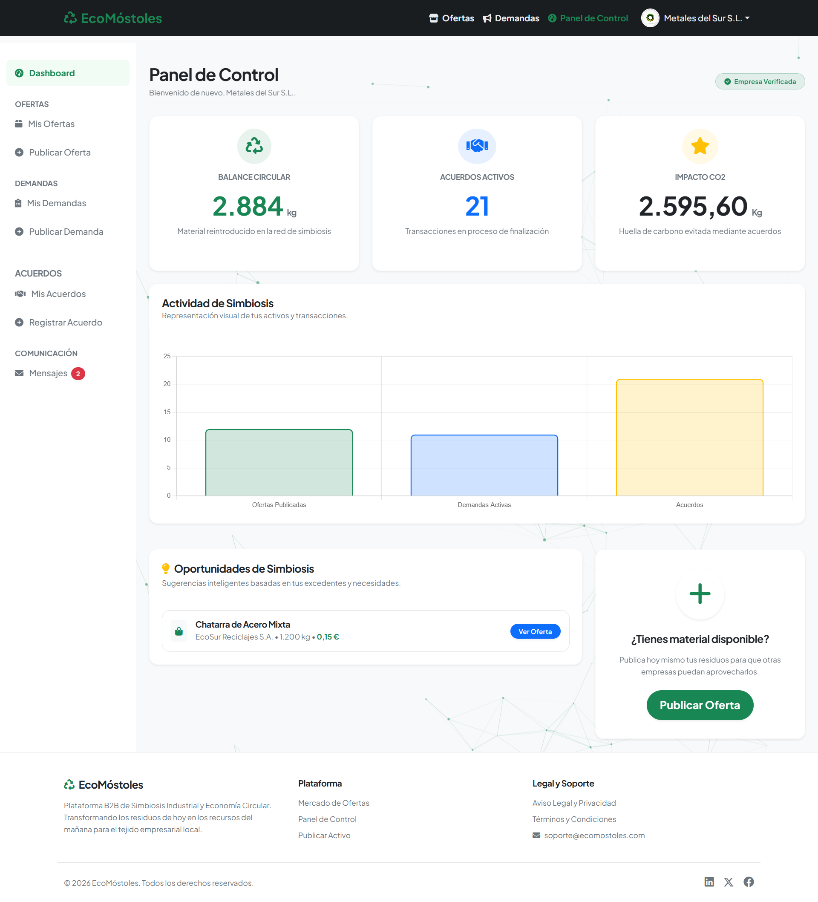

> Es el panel principal o área privada de cada empresa una vez inicia sesión. Desde aquí, el usuario puede ver de un vistazo un resumen de su actividad mediante indicadores (KPIs) y gráficos, como los acuerdos que tiene en curso o el CO2 acumulado que ha conseguido ahorrar. Además, la vista muestra sugerencias automáticas para conectar sus necesidades con los excedentes de otras empresas (Smart Matching) y ofrece accesos rápidos para publicar nuevas ofertas de materiales.

#### **7. Gestión de Identidad Corporativa (perfil_empresa.html)**

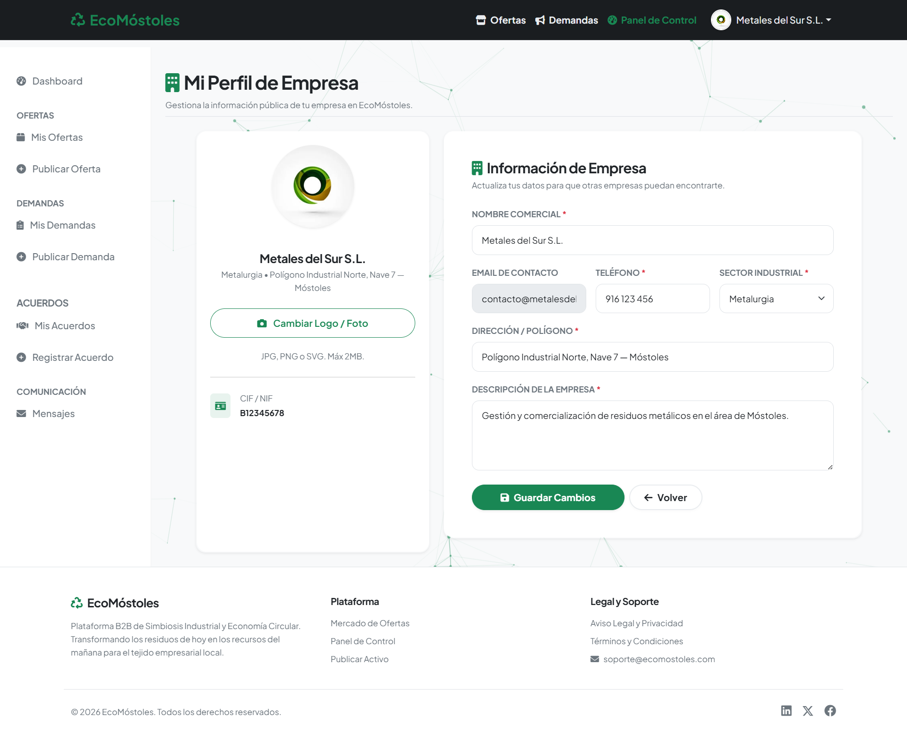

> Sección donde cada empresa puede visualizar y editar sus datos corporativos públicos, como su descripción, la información de contacto o el logotipo. Esta pantalla está diseñada para que la actualización de la información sea rápida e intuitiva. Además, la vista está programada para adaptarse según el rol, permitiendo que un Administrador pueda inspeccionar estos perfiles en modo lectura si necesita revisar o verificar los datos introducidos.

#### **8. Catálogo de Mercado Industrial (mercado.html)**

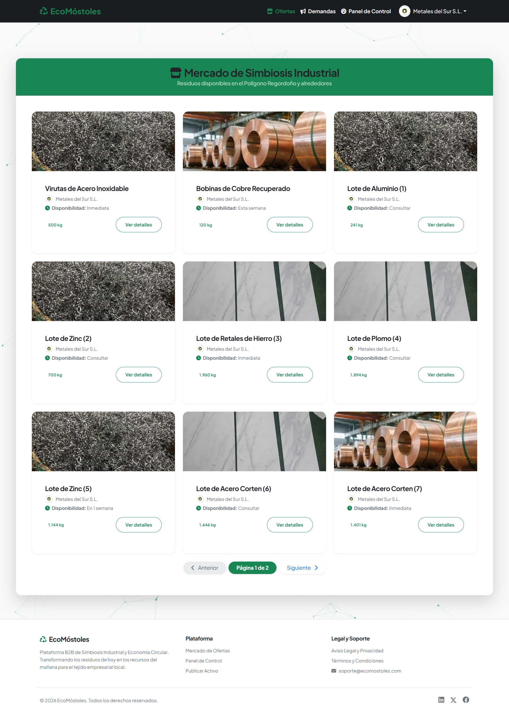

> Esta es la página principal de intercambio de la plataforma. Muestra un tablón general con todos los residuos y materiales que las empresas han publicado. Para facilitar la consulta, las ofertas se organizan en tarjetas visuales que muestran datos clave como la cantidad, la categoría y la disponibilidad. Además, incluye un sistema de paginación gestionado desde el backend con Spring Data para asegurar que la navegación sea rápida y fluida independientemente de la cantidad de anuncios publicados.

#### **9. Detalle de Oferta (detalle_activo.html)**

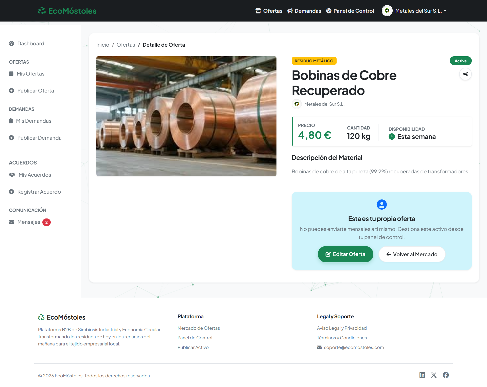

> Esta es la ficha completa de un material concreto que se ha publicado en el mercado. Aquí es donde una empresa interesada puede ver la foto real del residuo, el precio, las cantidades y quién lo vende. Lo más interesante de esta vista a nivel técnico es la lógica de roles que hemos programado en la plantilla: si el usuario que entra es el dueño del anuncio, el sistema le muestra los botones para editarlo o borrarlo; pero si es otra empresa distinta, la vista cambia y le ofrece un botón directo para abrir un chat de mensajería B2B y empezar a negociar.

#### **10. Tablón de Demandas (solicitudes.html)**

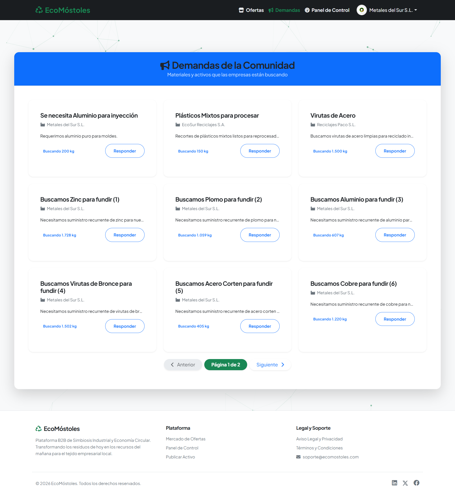

> Si el mercado principal es para ofrecer materiales, este tablón sirve exactamente para lo contrario: es el espacio donde las empresas publican lo que necesitan comprar o conseguir. Está estructurado mediante tarjetas visuales, reutilizando componentes de diseño para mantener la coherencia, y cuenta con su propia paginación independiente. Esta sección es clave en el proyecto porque permite lo que llamamos "economía circular inversa": en lugar de buscar qué sobra en la red, las empresas pueden buscar directamente quién necesita lo que a ellos les sobra.

#### **11. Detalle de Demanda (detalle_solicitud.html)**

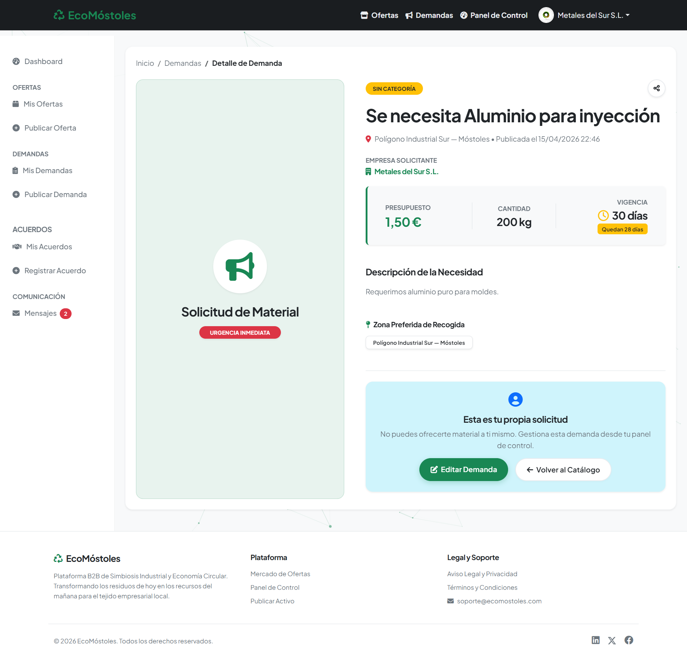

> Es la vista ampliada de una petición del tablón de demandas. A diferencia de las ofertas (donde importa el stock y la foto), aquí la interfaz se adapta para mostrar datos diferentes y muy específicos: el presupuesto máximo que la empresa está dispuesta a pagar, su nivel de urgencia, la zona preferida para la recogida y la fecha de caducidad del anuncio. Como en el resto de la plataforma, incluye el botón de contacto rápido para que un proveedor pueda iniciar la conversación y cerrar el trato al instante.

#### **12. Panel de Mis Publicaciones (mis_activos.html)**

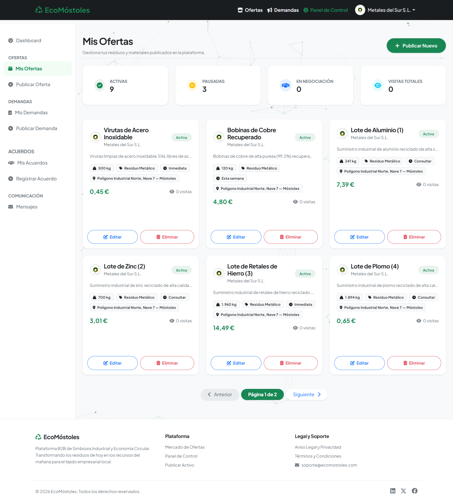

> Esta pantalla funciona como el inventario privado de cada empresa. A diferencia del mercado general, aquí el usuario solo ve los materiales que él mismo ha subido a la plataforma. Para darle un toque más profesional, hemos incluido un bloque superior con métricas propias del usuario, como el número total de visitas que han recibido sus anuncios o cuántos tiene activos en ese momento. Desde aquí, la empresa tiene el control total sobre su CRUD: puede editar textos, actualizar fotos o eliminar un anuncio cuando ya ha gestionado el residuo.

#### **13. Generación de Oferta (crear_activo.html)**

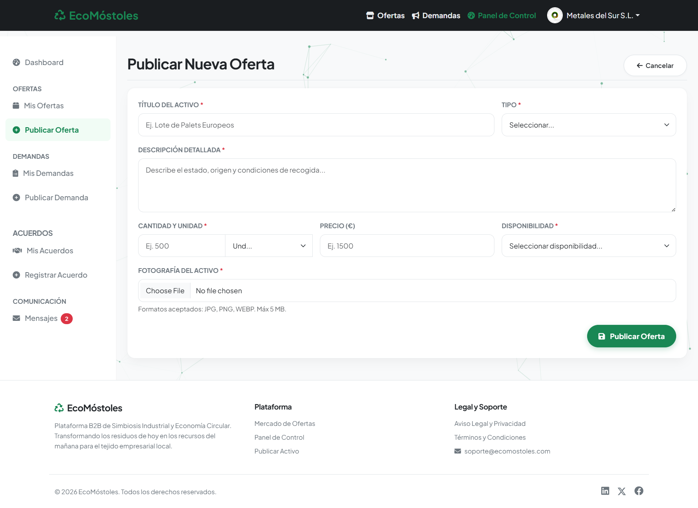

> Es el formulario de creación (el Create del CRUD) para publicar un nuevo residuo en el mercado. A nivel técnico, la vista incluye validaciones en el lado del cliente y del servidor para asegurar que los datos introducidos (como el precio, la cantidad o la categoría) tienen un formato correcto. Además, el formulario exige subir de manera obligatoria una imagen representativa del material, procesándola en el backend para garantizar que el tablón público mantenga siempre un aspecto visual profesional y atractivo.

#### **14. Edición de Oferta (editar_activo.html)**

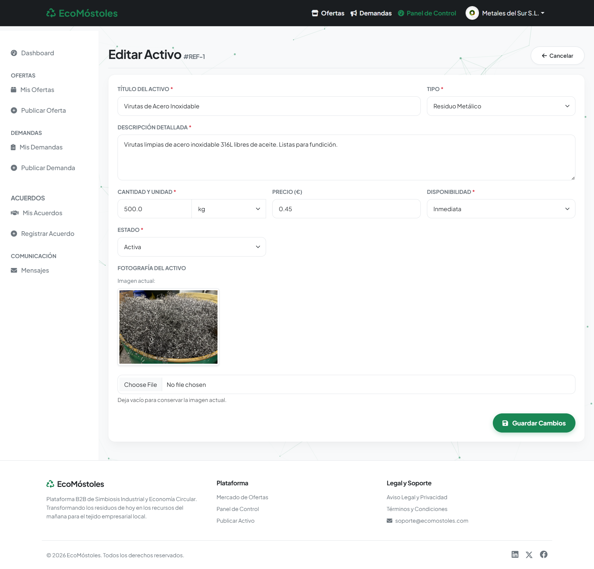

> Esta es la vista de actualización (el Update del CRUD) para las ofertas que la empresa ya tiene publicadas. Permite al usuario modificar cualquier parámetro del anuncio, como ajustar el precio, corregir el título o cambiar el estado del residuo a "Pausado" si temporalmente no está disponible. A nivel de usabilidad, la pantalla recupera y muestra la imagen que ya estaba guardada en la base de datos, permitiendo al usuario mantenerla o sustituirla por una nueva sin perder el resto de la información.

#### **15. Panel de Mis Demandas (mis_demandas.html)**

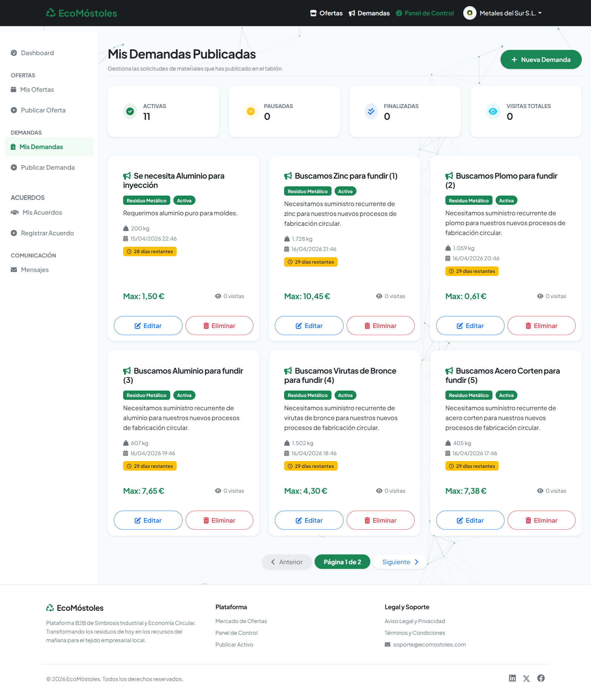

> Esta pantalla es el equivalente al panel de "Mis Publicaciones", pero enfocado exclusivamente en las peticiones de compra de la empresa. La interfaz proporciona un listado privado con las demandas activas, incorporando indicadores útiles generados desde el backend, como los días que le quedan de vigencia al anuncio o el número de visitas recibidas. Desde aquí, el usuario centraliza la gestión de sus necesidades, teniendo acceso directo a la edición o eliminación de sus registros si ya ha cerrado un acuerdo con un proveedor.

#### **16. Generación de Demanda (crear_solicitud.html)**

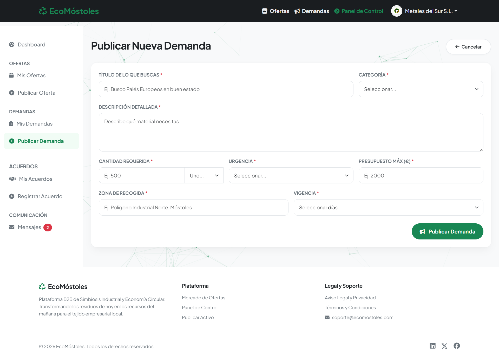

> Formulario diseñado para dar de alta una nueva necesidad o demanda en la plataforma. A diferencia de la creación de ofertas, esta interfaz está adaptada específicamente para recoger los datos clave de una petición de abastecimiento: qué material exacto se busca, el presupuesto máximo asignado y el nivel de urgencia. Todos los campos están mapeados directamente con el modelo de datos en Spring Boot, lo que permite alimentar automáticamente tanto el tablón público de demandas como el algoritmo interno de sugerencias (Smart Matching).

#### **17. Edición de Peticiones (editar_solicitud.html)**

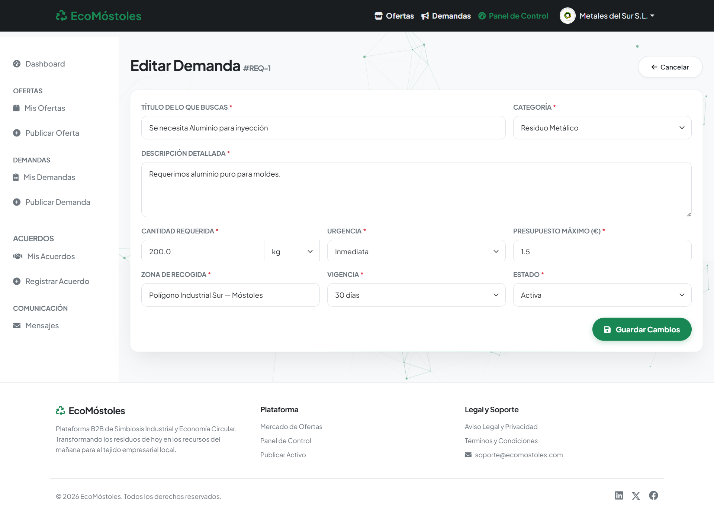

> Vista de actualización para las demandas de materiales. Aquí la empresa puede modificar los detalles de una petición que ya está en el tablón (por ejemplo, si necesita subir el presupuesto máximo para atraer a más proveedores o cambiar el nivel de urgencia). Esta funcionalidad completa el ciclo CRUD de las demandas y permite que la información de la base de datos se mantenga viva y actualizada sin obligar al usuario a borrar y crear registros nuevos continuamente.

#### **18. Bandeja de Mensajería (mensajes.html)**

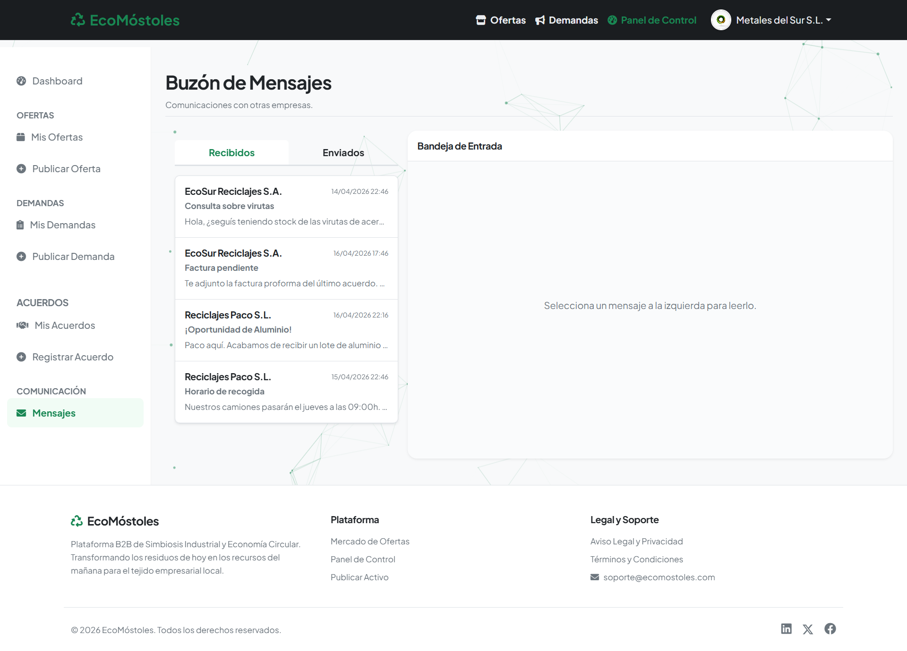

> Es la bandeja principal del sistema de mensajería interna. Se ha diseñado con una interfaz muy similar a un cliente de correo corporativo clásico, organizando las conversaciones en pestañas de mensajes recibidos y enviados. A nivel interno, este módulo gestiona las relaciones entre las entidades de la base de datos y cuenta con un sistema de estados booleanos para marcar visualmente en la plantilla qué mensajes están pendientes de leer. Es el espacio clave donde la plataforma pasa de ser un simple catálogo a un entorno real de negociación.

#### **19. Lectura de Mensaje (detalle_mensaje.html)**

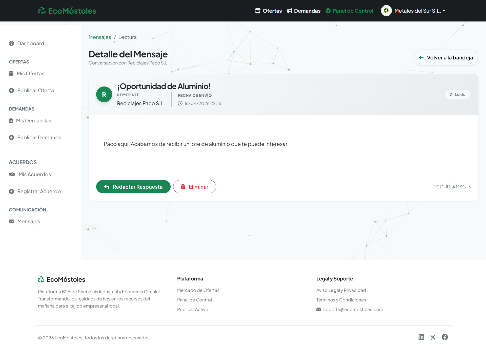

> Pantalla de lectura de un mensaje específico. Muestra de forma clara quién es el remitente (cargando dinámicamente su avatar y datos de la base de datos) junto a los metadatos de envío y el contenido de la conversación. Desde esta vista, la interfaz ofrece acciones rápidas que interactúan directamente con los controladores del backend: permite eliminar el mensaje para limpiar la bandeja o hacer clic en "Responder" para continuar la negociación de forma ágil y en el mismo hilo.

#### **20. Redacción de Mensajes (redactar_mensaje.html)**

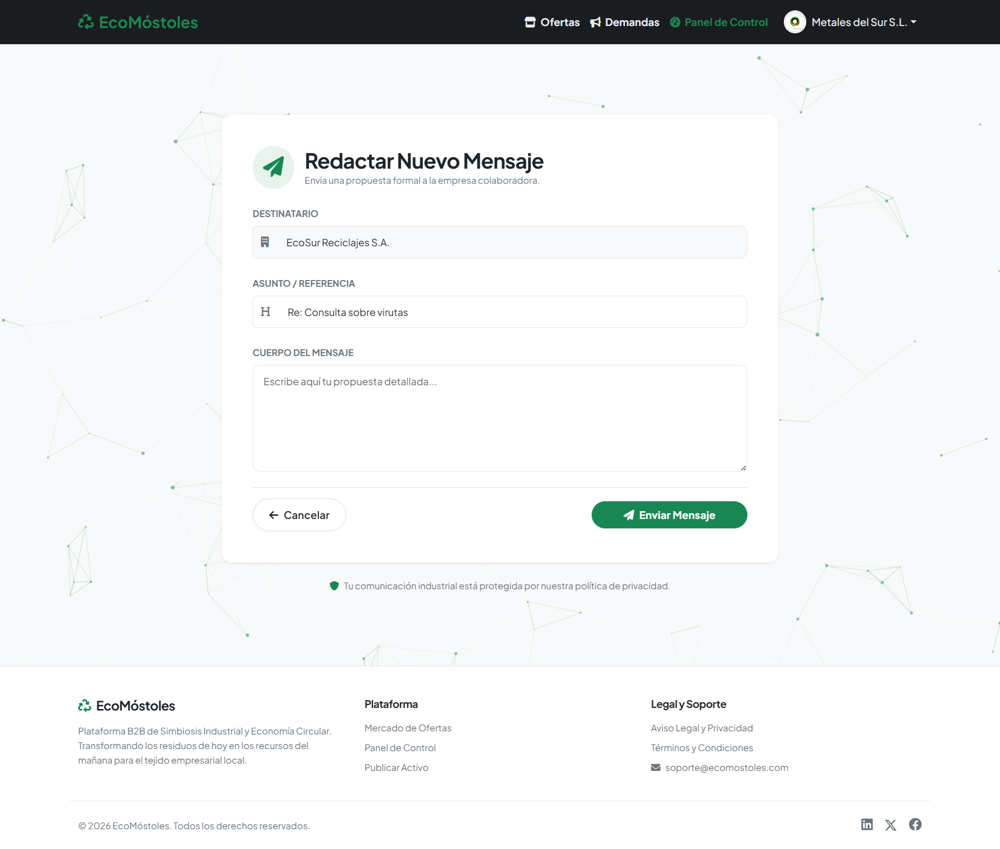

> Formulario diseñado para la creación y envío de nuevas comunicaciones B2B. Un detalle técnico importante de esta interfaz es que el destinatario del mensaje viene inyectado de forma segura desde el controlador de Spring Boot (se le pasa a la plantilla y queda fijado). Esto evita que el formulario pueda ser manipulado desde el cliente para enviar spam a otras empresas. Es una vista directa, con validación de campos obligatorios, pensada exclusivamente para agilizar el contacto comercial.

#### **21. Historial de Acuerdos (mis_acuerdos.html)**

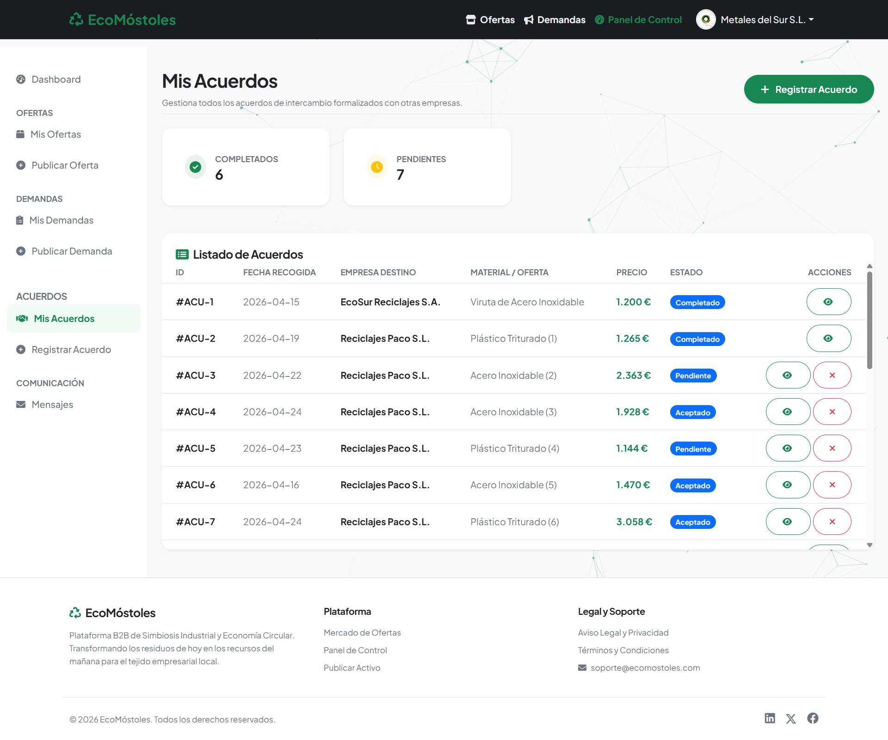

> Panel que sirve como registro histórico y activo de las transacciones de cada empresa. Muestra de forma estructurada los acuerdos en curso y los ya completados, permitiendo a los usuarios hacer un seguimiento logístico y económico de sus intercambios. Desde el punto de vista del desarrollo, esta vista es interesante porque consolida y cruza datos de múltiples tablas relacionales (ofertas, demandas y perfiles de empresa) para ofrecer métricas rápidas sobre el éxito de las operaciones del usuario en la plataforma.

#### **22. Registro de Nuevo Acuerdo (crear_acuerdo.html)**

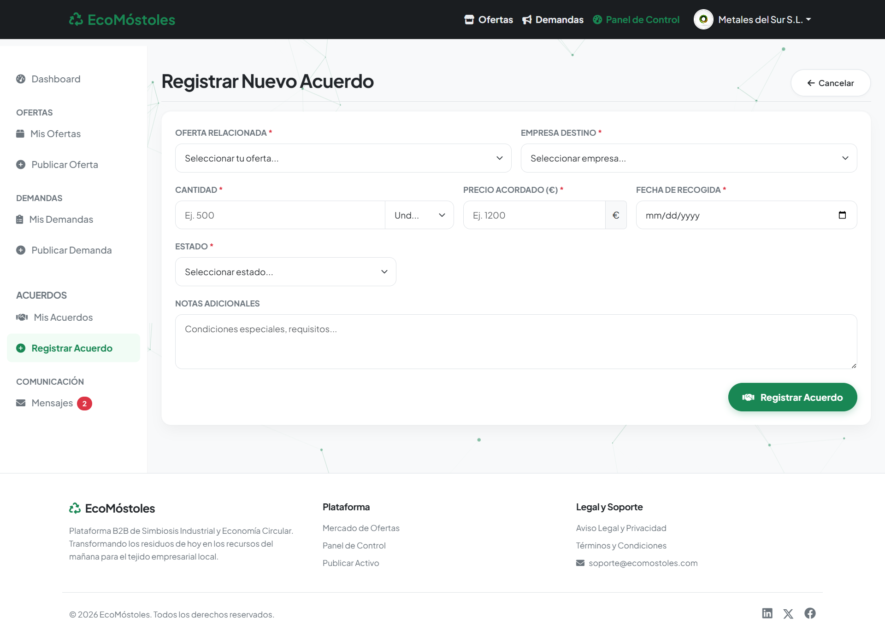

> Formulario donde se formaliza un pacto entre dos empresas tras una negociación exitosa en la mensajería. Aquí se vincula la oferta original con la empresa compradora y se registran los datos definitivos de la transacción (cantidad final, precio cerrado y fecha acordada de recogida). Esta pantalla es un punto crítico del sistema, ya que es la acción que desencadena el cálculo algorítmico del impacto medioambiental (CO2 ahorrado) y actualiza las estadísticas globales de la aplicación.

#### **23. Detalle y Albarán del Acuerdo (detalle_acuerdo.html)**

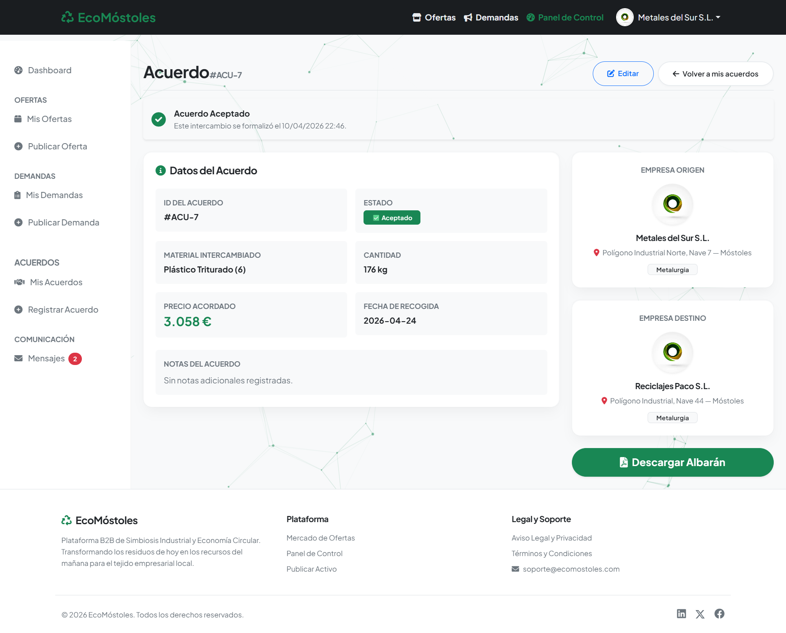

> Ficha completa de un acuerdo ya cerrado en el sistema. Presenta de forma clara y paralela los datos de la empresa de origen y la de destino, junto con las condiciones logísticas del intercambio. Un aspecto técnico a destacar en esta vista es la integración de una funcionalidad para la generación de documentos: permite a los usuarios descargar un albarán resumen en formato PDF, proporcionando un respaldo documental válido y descargable para la gestión interna de ambas entidades.

#### **24. Edición de Acuerdos (editar_acuerdo.html)**

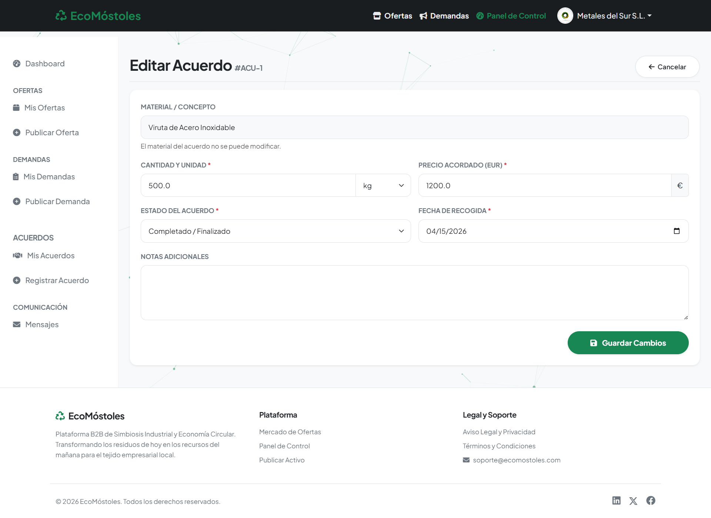

> Interfaz destinada a la actualización de los parámetros de un acuerdo en curso. En la lógica de negocio de la simbiosis industrial, es habitual que detalles como la fecha de recogida logística o las cantidades finales varíen a última hora. Este formulario permite ajustar esos datos o cambiar el estado del acuerdo a "Completado". A nivel de seguridad en el frontend y backend, atributos clave como el material original se mantienen bloqueados (solo lectura) para evitar alteraciones que corrompan la integridad de la base de datos.

#### **25. Panel General de Administración (admin_panel.html)**

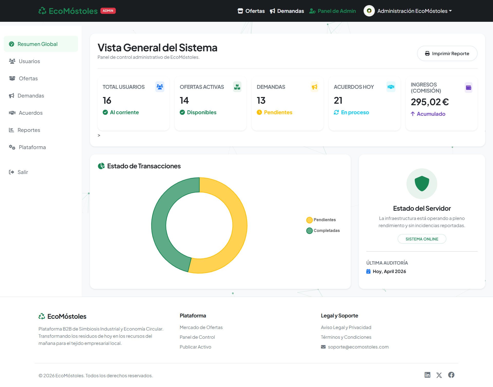

> El tablero de control principal, restringido exclusivamente a los usuarios autenticados con el rol de Administrador (ROLE_ADMIN). En lugar de mostrar datos individuales, aquí el servidor ejecuta consultas agregadas para representar métricas de toda la plataforma en tiempo real: total de usuarios registrados, volumen de acuerdos procesados y un cálculo de las comisiones generadas para la plataforma. Es la vista general para auditar el rendimiento y uso real de EcoMóstoles.

#### **26. Gestión de Usuarios y Roles (admin_usuarios.html)**

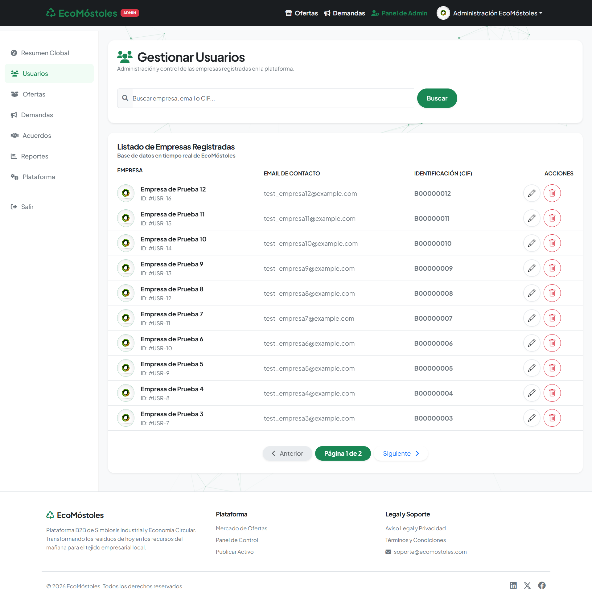

> Tabla de control donde el administrador gestiona la comunidad. Permite visualizar, editar o eliminar cualquier cuenta corporativa registrada. Para manejar el listado eficientemente, la vista implementa paginación mediante Spring Data. Un detalle técnico fundamental programado en esta sección es la capa de "inmunidad" del administrador: la lógica de las plantillas y del controlador bloquean cualquier intento de borrar la cuenta maestra, previniendo así un autoborrado accidental que dejaría la plataforma sin administración.

#### **27. Gestión Global de Ofertas (admin_ofertas.html)**

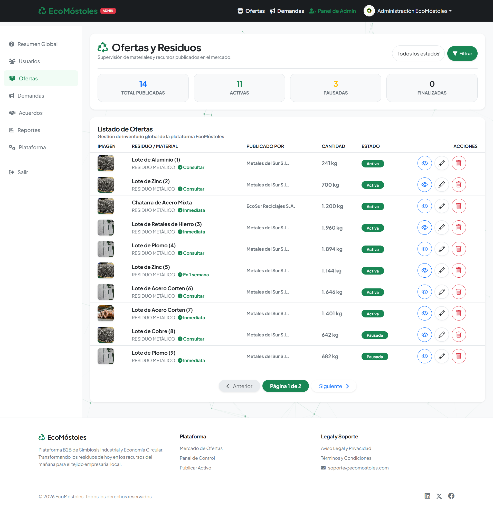

> Panel exclusivo para administradores que permite auditar todas las ofertas publicadas en la plataforma. Desde aquí, el administrador puede aplicar filtros por estado y revisar el catálogo completo para moderar el contenido. Si detecta un anuncio que incumple las normativas de la red o contiene información errónea, tiene permisos de alto nivel para editarlo o eliminarlo directamente, actuando como un filtro de calidad sobre el mercado B2B y garantizando la integridad del catálogo.

#### **28. Gestión Global de Demandas (admin_demandas.html)**

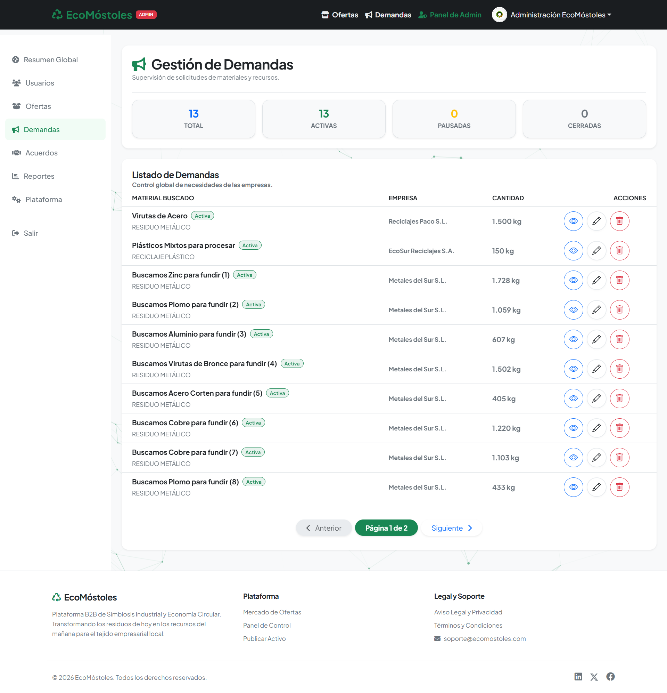

> Equivalente al panel anterior, pero enfocado en las peticiones de compra o abastecimiento de las empresas. Esta vista centraliza todas las demandas de la plataforma, proporcionando al administrador herramientas de moderación directa (inspección, edición y borrado). Su función técnica es vital para el mantenimiento de la base de datos, permitiendo limpiar registros duplicados, solicitudes caducadas o peticiones que no se ajusten a la dinámica de economía circular de la aplicación.

#### **29. Auditoría de Acuerdos (admin_acuerdos.html)**

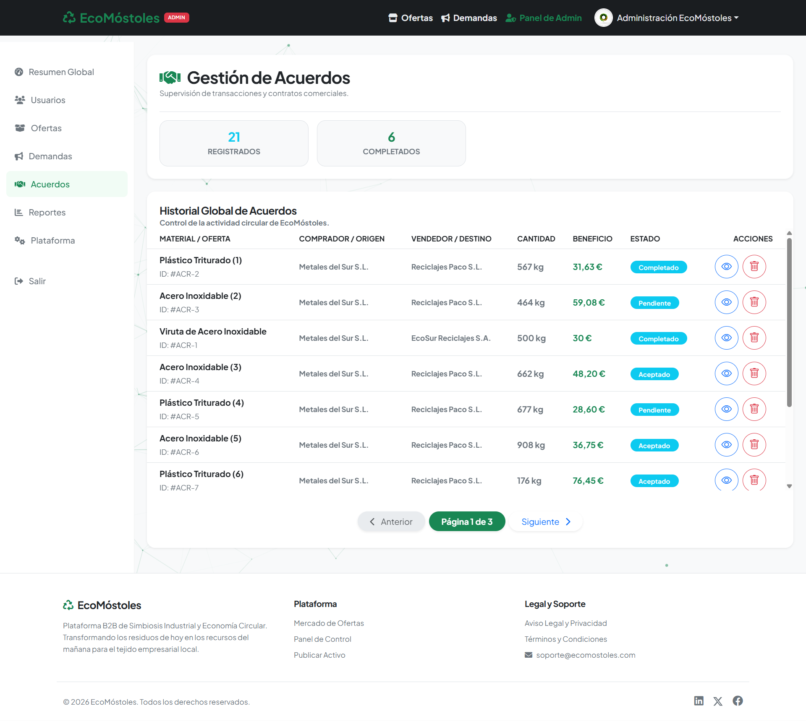

> Registro histórico y en tiempo real de todas las transacciones formalizadas en EcoMóstoles. Esta vista permite al administrador monitorizar la trazabilidad completa de los acuerdos entre empresas y supervisar las comisiones generadas para la plataforma. A nivel de base de datos, esta pantalla muestra un cruce complejo de información que actúa como libro de auditoría, garantizando que el flujo económico y logístico de los materiales quede registrado y sea transparente.

#### **30. Reportes y Sostenibilidad (admin_reportes.html)**

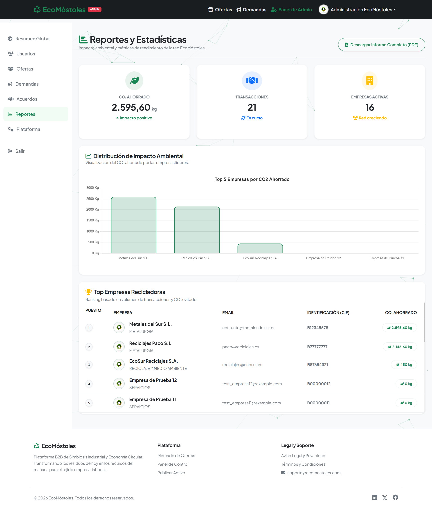

> Módulo analítico donde se consolida el impacto medioambiental del proyecto. El servidor procesa los datos de los acuerdos completados para calcular el ahorro total de CO2 y el volumen de materiales reutilizados, representándolos en gráficos interactivos y un ranking de las empresas más activas. Además, la vista integra una biblioteca de generación de documentos que permite al administrador exportar informes ejecutivos en formato PDF, ideales para justificar el éxito de la plataforma en auditorías o presentaciones.

#### **31. Configuración del Sistema (admin_configuracion.html)**

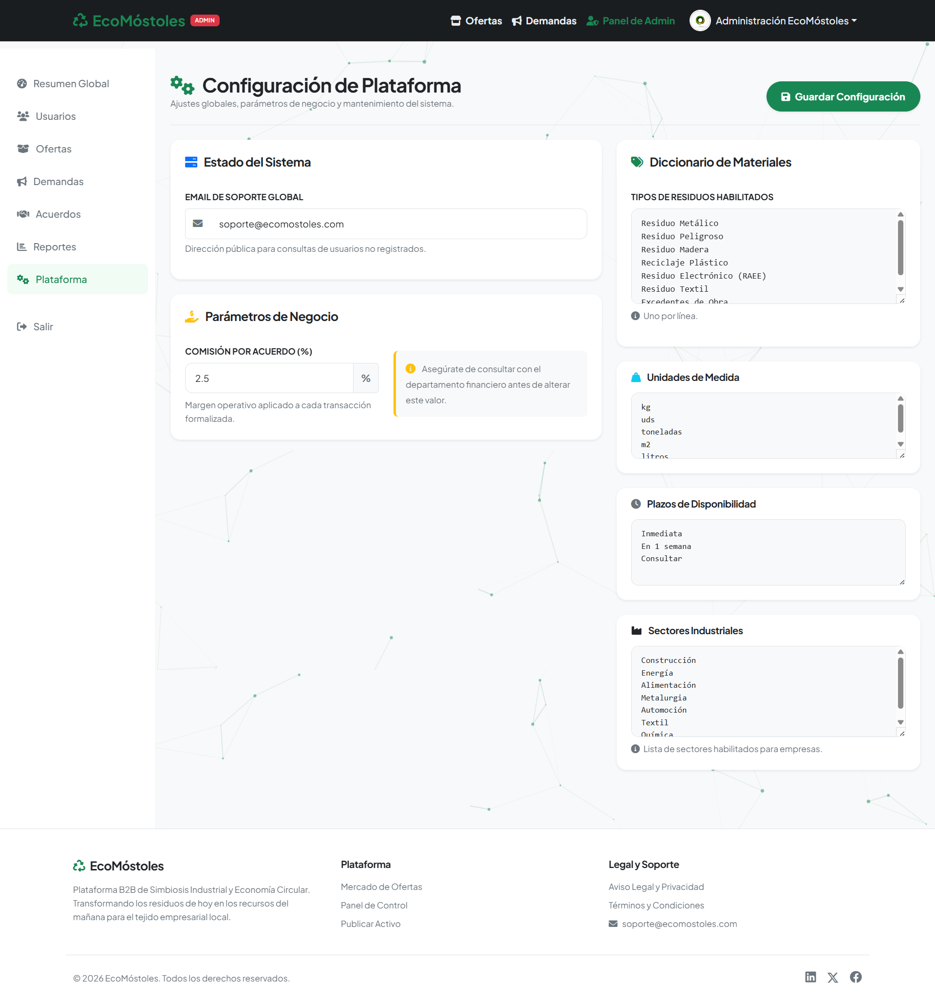

> Interfaz avanzada para gestionar los parámetros globales y reglas de negocio. En lugar de tener las variables hardcodeadas (escritas fijas en el código), el administrador puede modificar desde aquí el porcentaje de comisión de la plataforma o actualizar las listas maestras de la base de datos (categorías de residuos, unidades y sectores industriales). Esta aproximación arquitectónica hace que el proyecto sea altamente escalable, permitiendo adaptar la web a nuevas necesidades sin tocar el código fuente ni reiniciar el servidor.

#### **32. Gestión Personalizada de Errores (custom_error.html)**

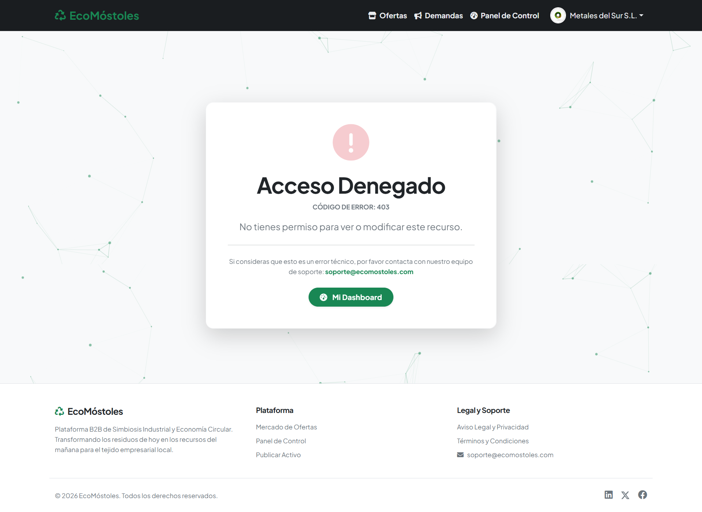

> Plantilla unificada para la captura de excepciones HTTP (como errores 404 de página no encontrada o 403 de acceso denegado). En lugar de mostrar la traza de error genérica de Tomcat, se intercepta el fallo y se presenta una pantalla amigable. El detalle técnico más destacado es que utiliza el contexto de Spring Security para detectar el rol del usuario en el momento del fallo, ofreciéndole dinámicamente una ruta de retorno segura y contextual (hacia el panel de empresa, el de administración o la página de inicio).

---

### **Instrucciones de Ejecución**

#### **Requisitos Previos**

- **Java**: Versión 21 o superior.
- **Maven**: Versión 3.8 o superior (`mvn`).
- **MySQL**: Versión 8.0 o superior (Instalación local).
- **Git**: Para la gestión del repositorio.

---

#### **Pasos para ejecutar la aplicación**

1. **Clonar el repositorio**

   ```bash
   git clone https://github.com/CodeURJC-SSDD-2025-26/practica-ssdd-2025-26-grupo-10.git
   cd practica-ssdd-2025-26-grupo-10
   ```

2. **Configurar la Base de Datos (MySQL)**

   La aplicación requiere un esquema llamado `ecomostoles`. Ejecuta lo siguiente en tu cliente MySQL (por ejemplo, desde MySQL Workbench):

   ```sql
   CREATE DATABASE ecomostoles;
   ```

3. **Configurar Variables de Entorno**

   Es recomendable configurar las siguientes variables de entorno para asegurar la conectividad y seguridad:
   | Variable | Descripción | Valor por defecto |
   | :------- | :---------- | :---------------- |
   | `DB_PASSWORD` | Contraseña de MySQL local | `root` (o vacío) |
   | `KEYSTORE_PASSWORD` | Contraseña del keystore SSL | `123456` |

4. **Compilar y ejecutar la aplicación**

   Asegúrate de estar en la carpeta donde se encuentra el código fuente del servidor:

   ```bash
   cd backend
   ```

   > **Nota:** Si tu contraseña de MySQL no es `root` (o está vacía), ejecútalo en tu terminal antes de continuar:
   >
   > - **Linux / macOS:** `export DB_PASSWORD=tu_contraseña`
   > - **Windows (CMD):** `set DB_PASSWORD=tu_contraseña`
   > - **Windows (PowerShell):** `$env:DB_PASSWORD="tu_contraseña"`

   **Opción A — Maven desde terminal (Recomendado):**
   Si tienes Maven instalado globalmente:

   ```bash
   mvn clean compile spring-boot:run
   ```

   Si **no** tienes Maven instalado, usa el **wrapper** incluido en el proyecto (Windows):

   ```bash
   .\mvnw clean compile spring-boot:run
   ```

   _(En Linux/macOS usa `./mvnw`)_

   **Opción B — Desde el IDE (IntelliJ / VS Code / Eclipse):**

   Ejecutar directamente la clase principal `es.urjc.ecomostoles.backend.BackendApplication`. Asegúrate de que el directorio de trabajo (working directory) sea la carpeta `backend`.

   **Opción C — Extensión Spring Boot Dashboard de VS Code:**

   Con la extensión instalada, aparecerá el proyecto en el panel lateral. Asegúrate de configurar la carpeta `backend` como el directorio de ejecución y pulsa el botón ▶ junto al proyecto para iniciarlo.

5. **Acceso a la aplicación**

   La aplicación se sirve exclusivamente por **HTTPS**. Abre en tu navegador:
   [https://localhost:8443](https://localhost:8443)

   > ⚠️ **ADVERTENCIA :**
   > El certificado es autofirmado. El navegador mostrará una advertencia de seguridad; por favor, acepta la excepción para continuar.

---

#### **Credenciales de prueba**

| Perfil                        | Usuario                     | Contraseña |
| :---------------------------- | :-------------------------- | :--------- |
| **Administrador**             | `admin@ecomostoles.es`      | `1234`     |
| **Empresa (Metales del Sur)** | `contacto@metalesdelsur.es` | `1234`     |
| **Empresa (EcoSur)**          | `reciclajes@ecosur.es`      | `1234`     |
| **Empresa (Paco)**            | `paco@reciclajes.es`        | `1234`     |

> 💡 **TIP :**
> **Metales del Sur S.L.** es la cuenta con mayor volumen de datos para testear la plataforma. Las otras dos cuentas de empresa son ideales para probar el sistema de **Smart Matching** por sectores y la mensajería interna.

### **Diagrama de Entidades de Base de Datos**

Diagrama mostrando las entidades, sus campos y relaciones:

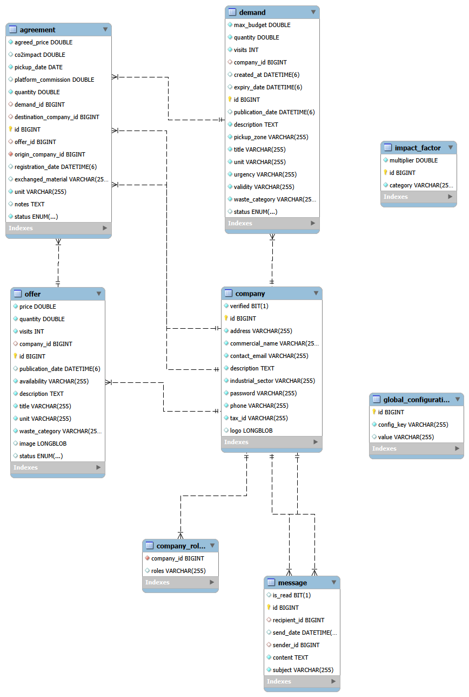

> Descripción del Modelo de Datos:
>
> El diagrama representa el modelo físico de la plataforma, articulado en torno a la entidad central company (Empresa). Se detallan las 5 entidades de negocio principales: offer (Activos ofertados), demand (Necesidades de material), agreement (Acuerdos comerciales), message (Comunicaciones B2B) e impact_factor (Métricas de impacto ambiental).
>
> El modelo utiliza relaciones 1:N para vincular a las empresas con sus publicaciones y mensajes. Destaca la entidad agreement, que actúa como nexo transaccional vinculando mediante Claves Foráneas (FK) tanto a la empresa origen como a la destino, junto con la oferta o demanda que originó el intercambio. Finalmente, se incluye la tabla técnica company_roles, que gestiona de forma normalizada el Control de Acceso Basado en Roles (RBAC) del sistema.

### **Diagrama de Clases y Templates**

Diagrama de clases de la aplicación con diferenciación por colores o secciones:

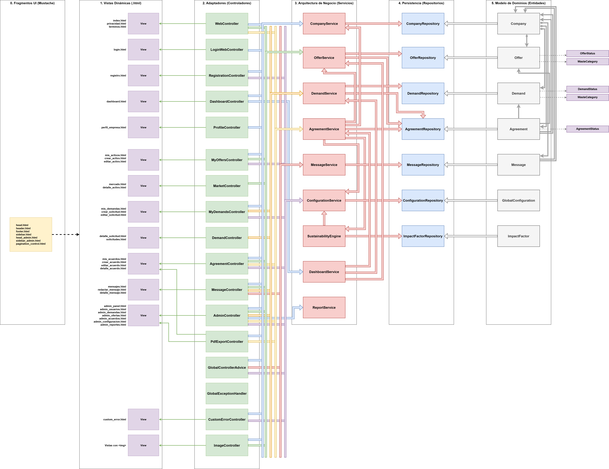

> El proyecto sigue una arquitectura **multicapa (N-Tier)** basada en Spring Boot, diseñada para garantizar la escalabilidad y el desacoplamiento de responsabilidades.
>
> - **Vistas y Controladores:** Se utiliza el patrón **MVC**. Los controladores actúan como adaptadores, gestionando la navegación y coordinando la comunicación entre las vistas dinámicas (`.html` con Mustache) y la capa de negocio.
> - **Capa de Negocio (Servicios):** Centraliza la lógica de la aplicación. Se han implementado servicios especializados y motores de cálculo (como el `SustainabilityEngine`) que interactúan entre sí para procesar reglas complejas.
> - **Modelo de Dominio y Persistencia:** Las entidades reflejan un modelo robusto con **relaciones bidireccionales** y gestión de ciclo de vida mediante **composición** (borrado en cascada). La persistencia se realiza a través de repositorios que abstraen el acceso a datos.
> - **Guía Visual:** El diagrama utiliza un código de colores por módulos para facilitar la trazabilidad completa desde la interfaz de usuario hasta el servicio correspondiente.

### **Participación de Miembros en la Práctica 2**

#### **Alumno 1 - Guillermo Domínguez Galindo**

En esta Práctica 2, mi responsabilidad abarcó la configuración inicial del backend y la mejora integral de la interfaz de usuario. A nivel de arquitectura, configuré la persistencia de datos integrando JPA y H2, y desarrollé el DatabaseInitializer para cargar datos de prueba en el sistema.

En cuanto a la gestión de usuarios y controladores, lideré la implementación del sistema de registro con validación de formularios y manejo de errores. Para ello, utilicé patrones DTO como RegistroDTO para asegurar la transferencia de datos. Además, implementé la recuperación de contraseñas y desarrollé la funcionalidad base para la creación y visualización detallada de ofertas.

Finalmente, en el frontend, llevé a cabo una refactorización exhaustiva de las plantillas HTML para integrar contenido dinámico, soporte de paginación y desplegables modulares mediante SelectOption DTO. También mejoré la robustez del sistema refactorizando la lógica de los cálculos de sostenibilidad y optimizando la respuesta ante errores, logrando así una navegación más estable.

| Nº  |                                                                                                                                                   Commits                                                                                                                                                    |                                                                                                                Files                                                                                                                 |
| :-: | :----------------------------------------------------------------------------------------------------------------------------------------------------------------------------------------------------------------------------------------------------------------------------------------------------------: | :----------------------------------------------------------------------------------------------------------------------------------------------------------------------------------------------------------------------------------: |
|  1  |                                                    [Add JPA and H2 dependencies; implement DatabaseInitializer for sample data](https://github.com/CodeURJC-SSDD-2025-26/practica-ssdd-2025-26-grupo-10/commit/83e680a60b168c2684d3c7befa77f4591a1798f1)                                                     | [DataInitializer.java](https://github.com/CodeURJC-SSDD-2025-26/practica-ssdd-2025-26-grupo-10/blob/83e680a60b168c2684d3c7befa77f4591a1798f1/backend/src/main/java/es/urjc/ecomostoles/backend/service/DatabaseInitializer.java) |
|  2  |                                                        [Refactor HTML templates for improved structure and dynamic content](https://github.com/CodeURJC-SSDD-2025-26/practica-ssdd-2025-26-grupo-10/commit/6c23b416f89edc4e7fa8cd2056182bfc25dfecec)                                                         | [AcuerdoController.java](https://github.com/CodeURJC-SSDD-2025-26/practica-ssdd-2025-26-grupo-10/blob/6c23b416f89edc4e7fa8cd2056182bfc25dfecec/backend/src/main/java/es/urjc/ecomostoles/backend/controller/AcuerdoController.java)  |
|  3  |                                                            [Refactor HTML templates for improved structure and styling](https://github.com/CodeURJC-SSDD-2025-26/practica-ssdd-2025-26-grupo-10/commit/b066b35f5b6bd0ec760ca3a69b1e48ec2a0d463b)                                                             | [AcuerdoController.java](https://github.com/CodeURJC-SSDD-2025-26/practica-ssdd-2025-26-grupo-10/blob/b066b35f5b6bd0ec760ca3a69b1e48ec2a0d463b/backend/src/main/java/es/urjc/ecomostoles/backend/controller/AcuerdoController.java)  |
|  4  | [feat: Implement user registration with validation; add RegistroDTO for data transfer, enhance error handling in registration form, and update templates for dynamic data binding.](https://github.com/CodeURJC-SSDD-2025-26/practica-ssdd-2025-26-grupo-10/commit/d4d3d5ebed3182cfa8ac838bd26cbdf01137b832) |             [RegistroDTO](https://github.com/CodeURJC-SSDD-2025-26/practica-ssdd-2025-26-grupo-10/blob/d4d3d5ebed3182cfa8ac838bd26cbdf01137b832/backend/src/main/java/es/urjc/ecomostoles/backend/dto/RegistroDTO.java)              |
|  5  |                                                          [feat: Enhance templates with new fields and pagination support](https://github.com/CodeURJC-SSDD-2025-26/practica-ssdd-2025-26-grupo-10/commit/02c072c346525495d9b647393b7b8fd01e1dd0ef)                                                           |     [DataInitializer.java](https://github.com/CodeURJC-SSDD-2025-26/practica-ssdd-2025-26-grupo-10/blob/02c072c346525495d9b647393b7b8fd01e1dd0ef/backend/src/main/java/es/urjc/ecomostoles/backend/config/DataInitializer.java)      |

---

#### **Alumno 2 - Daniel Nieto Díaz**

Durante la Práctica 2, mi rol se centró en asentar la arquitectura del backend, el blindaje de seguridad y la comunicación interna. A nivel de infraestructura, establecí el modelo de dominio relacional mediante Spring Data JPA, definiendo las entidades clave y sus relaciones.

En el ámbito de la seguridad y robustez, protegí la capa de controladores implementando prevenciones contra vulnerabilidades IDOR (ownership checks) y ataques CSRF. Además, complementé las notificaciones globales desarrollando el GlobalExceptionHandler, centralizando la captura de excepciones para mantener la estabilidad del sistema.

A nivel de negocio, diseñé e implementé desde cero el sistema de Mensajería B2B (repositorios y servicios) para permitir la negociación privada entre empresas, e integré la infraestructura de paginación (Pageable) en el servidor.

Finalmente, en la capa de presentación, configuré la herencia de componentes transversales en Mustache (partials) y realicé la integración de dependencias en los controladores, asegurando que el backend y los motores lógicos se comunicaran limpiamente con el frontend.

| Nº  |               Commits                |           Files           |
| :-: | :----------------------------------: | :-----------------------: |
|  1  | [Refactor database configuration to migrate from H2 to MySQL; integrate CSRF protection across all active forms and templates, and remove obsolete JavaScript files and unused views to streamline the architecture.](https://github.com/CodeURJC-SSDD-2025-26/practica-ssdd-2025-26-grupo-10/commit/fa6761dd60450fa77253ed0c1814dcc8d3e31617) | [AcuerdoService.java](https://github.com/CodeURJC-SSDD-2025-26/practica-ssdd-2025-26-grupo-10/blob/fa6761dd60450fa77253ed0c1814dcc8d3e31617/backend/src/main/java/es/urjc/ecomostoles/backend/service/AcuerdoService.java) |
|  2  | [Implement EmpresaDTO to enhance data security and encapsulation in controllers; calculate dynamic KPIs for the user dashboard, and introduce visit tracking metrics and new status enums for the offer management system.](https://github.com/CodeURJC-SSDD-2025-26/practica-ssdd-2025-26-grupo-10/commit/6fd696ba1f5b1c9d5624f2da07236ca95ed8828a) | [EmpresaDTO.java](https://github.com/CodeURJC-SSDD-2025-26/practica-ssdd-2025-26-grupo-10/blob/6fd696ba1f5b1c9d5624f2da07236ca95ed8828a/backend/src/main/java/es/urjc/ecomostoles/backend/dto/EmpresaDTO.java) |
|  3  | [Integrate global pagination for efficient user and data management; implement dynamic dropdown options for the registration flow, and enhance error handling mechanisms within the sustainability calculation engine.](https://github.com/CodeURJC-SSDD-2025-26/practica-ssdd-2025-26-grupo-10/commit/5426df3cb0f4e91dc796ae15cbfb3f54ccd49f7a) | [AdminController.java](https://github.com/CodeURJC-SSDD-2025-26/practica-ssdd-2025-26-grupo-10/blob/5426df3cb0f4e91dc796ae15cbfb3f54ccd49f7a/backend/src/main/java/es/urjc/ecomostoles/backend/controller/AdminController.java) |
|  4  | [Develop MessageService to establish a secure B2B internal messaging system and translate major sections of the codebase; refactor OfferService to decouple business logic, and update administrative templates to ensure proper layout rendering and pagination.](https://github.com/CodeURJC-SSDD-2025-26/practica-ssdd-2025-26-grupo-10/commit/efaa02c577ab2b21cfc73e79698be059fc8dc5a0) | [MessageService.java](https://github.com/CodeURJC-SSDD-2025-26/practica-ssdd-2025-26-grupo-10/blob/efaa02c577ab2b21cfc73e79698be059fc8dc5a0/backend/src/main/java/es/urjc/ecomostoles/backend/service/MessageService.java) |
|  5  | [Stabilize application architecture by implementing the PRG (Post-Redirect-Get) pattern and null-safe validations; standardize nomenclature, generate professional Javadoc documentation, and clean up technical debt.](https://github.com/CodeURJC-SSDD-2025-26/practica-ssdd-2025-26-grupo-10/commit/a97b86756778336b38fc2622612d70bde0ec1e3a) | [AdminController.java](https://github.com/CodeURJC-SSDD-2025-26/practica-ssdd-2025-26-grupo-10/blob/a97b86756778336b38fc2622612d70bde0ec1e3a/backend/src/main/java/es/urjc/ecomostoles/backend/controller/AdminController.java) |

---

#### **Alumno 3 - Alberto Sastre Zorrilla**

Durante el desarrollo de la Práctica 2, mi responsabilidad principal se centró en la implementación de la lógica de negocio compleja y la administración avanzada del sistema. Lideré el diseño y desarrollo del Sustainability Engine, un algoritmo diseñado para calcular el impacto ambiental (huella de CO2) basado en las transacciones entre ofertas y demandas, cumpliendo así con el requisito de "Algoritmo o Consulta Avanzada" de la rúbrica.

Además, gestioné la integridad de las transacciones mediante la prevención de auto-acuerdos y el control de estados de las entidades. En el ámbito de la administración, implementé el panel de gestión de usuarios, permitiendo al rol administrador listar, editar y eliminar perfiles. También integré la tecnología extra de generación de informes, desarrollando un servicio capaz de exportar datos críticos de la aplicación a formato PDF. Finalmente, aseguré la robustez del código mediante una refactorización integral, moviendo la lógica de los controladores a servicios especializados para garantizar una arquitectura limpia y escalable.

| Nº  |                                                                                                                                                                                     Commits                                                                                                                                                                                      |                                                                                                              Files                                                                                                              |
| :-: | :------------------------------------------------------------------------------------------------------------------------------------------------------------------------------------------------------------------------------------------------------------------------------------------------------------------------------------------------------------------------------: | :-----------------------------------------------------------------------------------------------------------------------------------------------------------------------------------------------------------------------------: |
|  1  | [Implement Sustainability Engine for environmental impact calculations; update services and controllers to utilize centralized CO2 impact metrics, enhance message deletion functionality, and improve template structures for better user experience.](https://github.com/CodeURJC-SSDD-2025-26/practica-ssdd-2025-26-grupo-10/commit/98e2e5cb85e003e5efc6291ea9f4e7ab1a5f6878) |   [AcuerdoService.java](https://github.com/CodeURJC-SSDD-2025-26/practica-ssdd-2025-26-grupo-10/blob/98e2e5cb85e003e5efc6291ea9f4e7ab1a5f6878/backend/src/main/java/es/urjc/ecomostoles/backend/service/AcuerdoService.java)    |
|  2  |                         [Enhance Admin functionalities with user management and reporting features; add user deletion and editing, improve dashboard metrics, and implement report generation service for PDF and CSV exports.](https://github.com/CodeURJC-SSDD-2025-26/practica-ssdd-2025-26-grupo-10/commit/7d389d07df9d99f9a9cacf4b2f5126dd0828fd30)                         | [AdminController.java](https://github.com/CodeURJC-SSDD-2025-26/practica-ssdd-2025-26-grupo-10/blob/7d389d07df9d99f9a9cacf4b2f5126dd0828fd30/backend/src/main/java/es/urjc/ecomostoles/backend/controller/AdminController.java) |
|  3  |                                                                                      [Implement PDF export functionality and enhance message composition features](https://github.com/CodeURJC-SSDD-2025-26/practica-ssdd-2025-26-grupo-10/commit/2144f03a3449d4b1effa96b15a16d5d3903ca5e7)                                                                                      | [AdminController.java](https://github.com/CodeURJC-SSDD-2025-26/practica-ssdd-2025-26-grupo-10/blob/2144f03a3449d4b1effa96b15a16d5d3903ca5e7/backend/src/main/java/es/urjc/ecomostoles/backend/controller/AdminController.java) |
|  4  |                                                       [Implement self-agreement prevention, enhance dynamic select options, and improve user experience across various templates and controllers](https://github.com/CodeURJC-SSDD-2025-26/practica-ssdd-2025-26-grupo-10/commit/b649e0b612742a04bebc8d50899584f3523c914c)                                                       |   [AcuerdoService.java](https://github.com/CodeURJC-SSDD-2025-26/practica-ssdd-2025-26-grupo-10/blob/b649e0b612742a04bebc8d50899584f3523c914c/backend/src/main/java/es/urjc/ecomostoles/backend/service/AcuerdoService.java)    |
|  5  |                                                                                          [Refactor controllers and services for improved logic and structure](https://github.com/CodeURJC-SSDD-2025-26/practica-ssdd-2025-26-grupo-10/commit/546120a0feaaffb03c894054823a1d15c7428785)                                                                                           |   [AcuerdoService.java](https://github.com/CodeURJC-SSDD-2025-26/practica-ssdd-2025-26-grupo-10/blob/546120a0feaaffb03c894054823a1d15c7428785/backend/src/main/java/es/urjc/ecomostoles/backend/service/AcuerdoService.java)    |

---

#### **Alumno 4 - Javier de la Casa Muñoz**

Durante esta etapa, mi responsabilidad se centró en la implementación de la lógica de negocio avanzada y el desarrollo del módulo de sostenibilidad. Lideré el diseño de un sistema para calcular el impacto ambiental basado en factores dinámicos y tipos de materiales, cumpliendo con los requisitos de funcionalidad compleja. Además, robustecí la arquitectura mediante el uso de Enums para la gestión de estados y un Global Controller Advice para centralizar la lógica de notificaciones, asegurando una comunicación fluida entre el backend y las vistas de ofertas y demandas.

Asimismo, gestioné la optimización del frontend y la administración del sistema. Implementé los controladores de Mercado y Demanda para garantizar una visualización dinámica de datos, y realicé una refactorización integral de las plantillas HTML para eliminar valores estáticos. Este trabajo incluyó la mejora de las funcionalidades de administración y la configuración global de la plataforma, logrando una arquitectura más limpia, escalable y adaptada a las necesidades del usuario final.

| Nº  |                                                                                                                                                         Commits                                                                                                                                                         |                                                                                                               Files                                                                                                                |
| :-: | :---------------------------------------------------------------------------------------------------------------------------------------------------------------------------------------------------------------------------------------------------------------------------------------------------------------------: | :--------------------------------------------------------------------------------------------------------------------------------------------------------------------------------------------------------------------------------: |
|  1  | [Add DemandaController and update Demanda and Oferta models with formatted quantity and price methods; modify mercado.html and solicitudes.html to display formatted values and enhance layout.](https://github.com/CodeURJC-SSDD-2025-26/practica-ssdd-2025-26-grupo-10/tree/631adf712d48dc36b41684bb1c6ec102a34853d4) | [DemandaControler.java](https://github.com/CodeURJC-SSDD-2025-26/practica-ssdd-2025-26-grupo-10/blob/631adf712d48dc36b41684bb1c6ec102a34853d4/backend/src/main/java/es/urjc/ecomostoles/backend/controller/DemandaController.java) |
|  2  |                           [Implement global controller advice for message count, refactor offer and demand states to enums, and enhance message handling in templates](https://github.com/CodeURJC-SSDD-2025-26/practica-ssdd-2025-26-grupo-10/tree/827ef4cf6212c6c882c2f98cdd0558f71e31c291)                           |    [DataInitializer.java](https://github.com/CodeURJC-SSDD-2025-26/practica-ssdd-2025-26-grupo-10/blob/827ef4cf6212c6c882c2f98cdd0558f71e31c291/backend/src/main/java/es/urjc/ecomostoles/backend/config/DataInitializer.java)     |
|  3  |                                                                 [Enhance admin functionalities and add configuration management](https://github.com/CodeURJC-SSDD-2025-26/practica-ssdd-2025-26-grupo-10/tree/a90af835e6b25a68bf22f8b9d570725a1bd92890)                                                                 |  [AdminController.java](https://github.com/CodeURJC-SSDD-2025-26/practica-ssdd-2025-26-grupo-10/blob/a90af835e6b25a68bf22f8b9d570725a1bd92890/backend/src/main/java/es/urjc/ecomostoles/backend/controller/AdminController.java)   |
|  4  |                                                                  [Refactor templates to use dynamic platform name and location](https://github.com/CodeURJC-SSDD-2025-26/practica-ssdd-2025-26-grupo-10/tree/0cbb23ed4ad0ea9c4ea0e7bfc0cb81b0975f2ca8)                                                                  |    [CsrfModelAdvice.java](https://github.com/CodeURJC-SSDD-2025-26/practica-ssdd-2025-26-grupo-10/blob/0cbb23ed4ad0ea9c4ea0e7bfc0cb81b0975f2ca8/backend/src/main/java/es/urjc/ecomostoles/backend/config/CsrfModelAdvice.java)     |
|  5  |                                                       [Refactor template variables for consistency and clarity across multiple HTML files](https://github.com/CodeURJC-SSDD-2025-26/practica-ssdd-2025-26-grupo-10/tree/c8afe10b4187c9ade48d75c2c9325922a9d721a7)                                                       |  [AdminController.java](https://github.com/CodeURJC-SSDD-2025-26/practica-ssdd-2025-26-grupo-10/blob/c8afe10b4187c9ade48d75c2c9325922a9d721a7/backend/src/main/java/es/urjc/ecomostoles/backend/controller/AdminController.java)   |

---

## 🛠 **Práctica 3: API REST, docker y despliegue**

### **Documentación de la API REST**

#### **Especificación OpenAPI**

📄 **[Especificación OpenAPI (YAML)](/api-docs/api-docs.yaml)**

#### **Documentación HTML**

📖 **[Documentación API REST (HTML)](https://raw.githack.com/[usuario]/[repositorio]/main/api-docs/api-docs.html)**

> La documentación de la API REST se encuentra en la carpeta `/api-docs` del repositorio. Se ha generado automáticamente con SpringDoc a partir de las anotaciones en el código Java.

### **Diagrama de Clases y Templates Actualizado**

Diagrama actualizado incluyendo los @RestController y su relación con los @Service compartidos:


### **Instrucciones de Ejecución con Docker**

#### **Requisitos previos:**

- Docker instalado (versión 20.10 o superior)
- Docker Compose instalado (versión 2.0 o superior)

#### **Pasos para ejecutar con docker-compose:**

1. **Clonar el repositorio** (si no lo has hecho ya):

   ```bash
   git clone https://github.com/[usuario]/[repositorio].git
   cd [repositorio]
   ```

2. **AQUÍ LOS SIGUIENTES PASOS**:

### **Construcción de la Imagen Docker**

#### **Requisitos:**

- Docker instalado en el sistema

#### **Pasos para construir y publicar la imagen:**

1. **Navegar al directorio de Docker**:

   ```bash
   cd docker
   ```

2. **AQUÍ LOS SIGUIENTES PASOS**

### **Despliegue en Máquina Virtual**

#### **Requisitos:**

- Acceso a la máquina virtual (SSH)
- Clave privada para autenticación
- Conexión a la red correspondiente o VPN configurada

#### **Pasos para desplegar:**

1. **Conectar a la máquina virtual**:

   ```bash
   ssh -i [ruta/a/clave.key] [usuario]@[IP-o-dominio-VM]
   ```

   Ejemplo:

   ```bash
   ssh -i ssh-keys/app.key vmuser@10.100.139.XXX
   ```

2. **AQUÍ LOS SIGUIENTES PASOS**:

### **URL de la Aplicación Desplegada**

🌐 **URL de acceso**: `https://[nombre-app].etsii.urjc.es:8443`

#### **Credenciales de Usuarios de Ejemplo**

| Rol                | Usuario | Contraseña |
| :----------------- | :------ | :--------- |
| Administrador      | admin   | admin123   |
| Usuario Registrado | user1   | user123    |
| Usuario Registrado | user2   | user123    |

### **OTRA DOCUMENTACIÓN ADICIONAL REQUERIDA EN LA PRÁCTICA**

### **Participación de Miembros en la Práctica 3**

#### **Alumno 1 - [Nombre Completo]**

[Descripción de las tareas y responsabilidades principales del alumno en el proyecto]

| Nº  |               Commits                |           Files           |
| :-: | :----------------------------------: | :-----------------------: |
|  1  | [Descripción commit 1](URL_commit_1) | [Archivo1](URL_archivo_1) |
|  2  | [Descripción commit 2](URL_commit_2) | [Archivo2](URL_archivo_2) |
|  3  | [Descripción commit 3](URL_commit_3) | [Archivo3](URL_archivo_3) |
|  4  | [Descripción commit 4](URL_commit_4) | [Archivo4](URL_archivo_4) |
|  5  | [Descripción commit 5](URL_commit_5) | [Archivo5](URL_archivo_5) |

---

#### **Alumno 2 - [Nombre Completo]**

[Descripción de las tareas y responsabilidades principales del alumno en el proyecto]

| Nº  |               Commits                |           Files           |
| :-: | :----------------------------------: | :-----------------------: |
|  1  | [Descripción commit 1](URL_commit_1) | [Archivo1](URL_archivo_1) |
|  2  | [Descripción commit 2](URL_commit_2) | [Archivo2](URL_archivo_2) |
|  3  | [Descripción commit 3](URL_commit_3) | [Archivo3](URL_archivo_3) |
|  4  | [Descripción commit 4](URL_commit_4) | [Archivo4](URL_archivo_4) |
|  5  | [Descripción commit 5](URL_commit_5) | [Archivo5](URL_archivo_5) |

---

#### **Alumno 3 - [Nombre Completo]**

[Descripción de las tareas y responsabilidades principales del alumno en el proyecto]

| Nº  |               Commits                |           Files           |
| :-: | :----------------------------------: | :-----------------------: |
|  1  | [Descripción commit 1](URL_commit_1) | [Archivo1](URL_archivo_1) |
|  2  | [Descripción commit 2](URL_commit_2) | [Archivo2](URL_archivo_2) |
|  3  | [Descripción commit 3](URL_commit_3) | [Archivo3](URL_archivo_3) |
|  4  | [Descripción commit 4](URL_commit_4) | [Archivo4](URL_archivo_4) |
|  5  | [Descripción commit 5](URL_commit_5) | [Archivo5](URL_archivo_5) |

---

#### **Alumno 4 - [Nombre Completo]**

[Descripción de las tareas y responsabilidades principales del alumno en el proyecto]

| Nº  |               Commits                |           Files           |
| :-: | :----------------------------------: | :-----------------------: |
|  1  | [Descripción commit 1](URL_commit_1) | [Archivo1](URL_archivo_1) |
|  2  | [Descripción commit 2](URL_commit_2) | [Archivo2](URL_archivo_2) |
|  3  | [Descripción commit 3](URL_commit_3) | [Archivo3](URL_archivo_3) |
|  4  | [Descripción commit 4](URL_commit_4) | [Archivo4](URL_archivo_4) |
|  5  | [Descripción commit 5](URL_commit_5) | [Archivo5](URL_archivo_5) |

---
